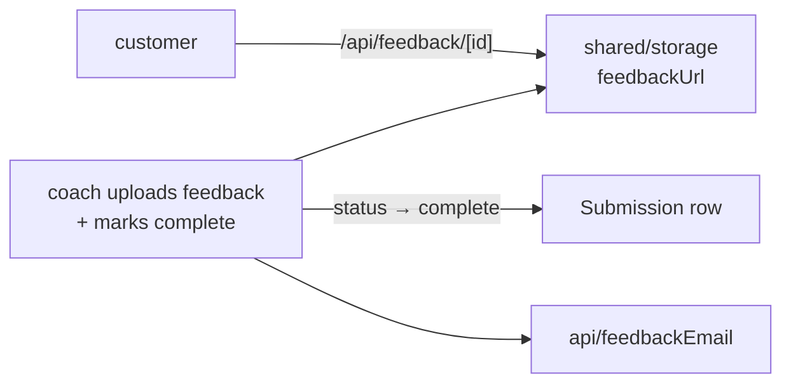

# feedback — `src/domains/feedback/`

The **feedback domain slice** — the coach's response coming back. The thinnest slice in the
codebase, and honestly so: in v1 the actual coaching happens entirely off-platform.

---

## 1 · The northstar

A coach watches the customer's video and records a walkthrough. From the **coach portal**
they upload that file and mark the submission `complete`; we store the file and email the
customer their download link. By then they've been gone for days, so email is the only way
to reach them.

### The invariants

- **The feedback download is public but complete-only.** `/api/feedback/[id]` serves the
  file only once `status = complete`. The customer isn't logged in and reaches it from their
  status lookup; the id is an unguessable uuid — the same URL-as-capability trade-off the
  status page already makes.
- **The email is best-effort** ([ADR 004](../../../docs/decisions/004-best-effort-email.md)) —
  a send failure never blocks marking a submission complete.
- **`feedbackEmailedAt` guards a double-send** — checked before, stamped after (wired with
  the coach portal's complete action).

### The pieces

- `api/feedbackEmail.ts` — the payoff message ("your feedback is ready").
- No model, no UI **yet** — the coach-facing upload + mark-complete lands in the coach
  portal (in progress); this slice owns the email and will own the completion logic.

---

> **Updated 2026-07-30.** Two things changed under this slice without changing its code much:
>
> - **Completing now starts a clock.** `storeFeedbackAndComplete` stamps `completedAt` as
>   well as the status, because the retention sweep counts from it. It briefly didn't, and
>   completed submissions were never swept — the status said finished while the clock never
>   started. If another action ever takes over "complete", it must stamp it too.
> - **The customer's uploads are deleted `retainResolvedHours` after that stamp; the coach's
>   feedback file never is.** The customer's only route to what they bought is the link in
>   their email, so sweeping `feedbackUrl` would delete the deliverable
>   ([ADR 012](../../../docs/decisions/012-retention-and-operator-settings.md)).
>
> - **the admin's approval gate landed.** A coach's upload now moves the submission to
>   `awaiting_approval` rather than completing it; `approveAndComplete` is what sets
>   `complete`, stamps `completedAt`, and emails the customer. The coach no longer reaches the
>   customer directly. Still missing: anything that *tells* the admin a response is waiting — see
>   [`shared/email/_EmailDocumentation.md`](../../shared/email/_EmailDocumentation.md).
>
> **Updated 2026-08-01 · feedback is multi-file now.** A coach can attach **several** files
> and hand the set to the admin. Each file is a row in `submission_file` with `kind = "feedback"`
> (the old single `feedbackUrl` column is unused), uploaded through the customer's own
> transport with operator-gated endpoints — direct-to-Blob in prod (`/api/feedback/blob` +
> `/api/feedback/complete`), proxied to disk in dev (`/api/feedback/upload`). Attaching a file
> no longer advances the submission; a separate `sendFeedbackForApproval` (guarded to require
> ≥1 file) parks it at `awaiting_approval`, and `approveAndComplete` (guarded the same way)
> finishes it. `/api/feedback/[id]` now serves a feedback file **by the file's own id**, and
> the admin review lists every file.
>
> **Delivery is an unguessable capability link, not the email lookup.** The "feedback is
> ready" email carries a **signed token** (`signFeedbackToken`, one-year expiry, bound to
> `purpose: "feedback"`) and points at `/feedback/<token>` — a public page that lists this one
> submission's files. The status lookup (`/status`, email-as-identity) **no longer exposes the
> feedback files at all**: it only reports that a review is ready. That closes a real hole —
> before, anyone who guessed an email got the download links straight from the lookup.
> `PublicSubmission` carries a `hasFeedback` flag now, never the file ids.
>
> **Two doors, one guarantee — you must control the inbox.** Beyond the emailed link, the
> `/status` page keeps its email entry: when a lookup shows a completed review, the customer
> can request a **6-digit access code** (`issueFeedbackViewCode` → `sendFeedbackViewCode`),
> read it back, and see their download links inline (`verifyFeedbackViewCode`). It's stateless
> — a keyed fingerprint of the code rides in a short-lived signed httpOnly cookie (`bs_fbcode`),
> no schema change — and it is **not an account** (CLAUDE.md §2): no password, nothing to sign
> into, expires in ten minutes. Both routes (`/api/status/feedback/{code,verify}`) are
> rate-limited, and the code request always answers `ok` so it never confirms which addresses
> exist. This is the sibling of the flow's upload-gating verification, for a different purpose:
> proving inbox control to *release* feedback rather than to *accept* an upload.
>
> **Updated 2026-08-29 · the view code is HMAC'd, capped, and gates the whole view.** Three
> hardenings landed on the status-page path after the security/correctness hunt (2026-08-26,
> #9/#10) and QA 3.2 (2026-08-29):
>
> - **The cookie carries an HMAC fingerprint, not a bcrypt hash** (`fingerprint` keyed to
>   `AUTH_SECRET`). The cookie payload is readable by whoever received the `Set-Cookie`, and a
>   bcrypt hash of a 6-digit code sitting there is an offline brute-force that falls in minutes;
>   an HMAC can't be run against candidates without the server-held key. The match is a
>   constant-time `timingSafeEqual` over the hex.
> - **A code tolerates `MAX_FEEDBACK_CODE_ATTEMPTS` wrong guesses, then burns** — the count
>   rides in the signed cookie (no attempt column). It's the *same* figure as the flow
>   verification gate (`MAX_CODE_ATTEMPTS`), one source of truth so the two can't drift.
> - **The code now gates the whole customer view, not just released downloads.** Any submission
>   for the email earns a code (a mid-review customer must still be able to see their own
>   submission), and one code grants both the status list and the downloads
>   (`StatusAccess` = `{ submissions, groups }`) — one act of proof, one grant. The empty-inbox
>   case returns a decoy fingerprint and sends no mail, so the response is identical whether or
>   not the address exists.

## 2b · Fixed 2026-08-02

- 🔴 **Approval refused translated responses.** The mirror of the hand-off bug:
  a translated response sits at `feedback_translated`, and `approveAndComplete`
  only accepted `awaiting_approval` — so a review could be translated and then
  never sent.
- ✅ **The bounce message names the kind of failure.** `hard` says the address
  doesn't exist, `soft` says the inbox couldn't take it, and an unrecognised
  classification gets wording true of both. Telling someone with a full mailbox
  to check for a typo sends them hunting for a mistake they didn't make.

## 2 · Where we are now — 2026-08-01

This slice grew from "the coach's response" into **the response's whole life after
delivery** — collected, resolved, warned, purged — because all four are about the
thing it produces.

- ✅ **⑤ on delivery** — the admin *and* the coach are told a review is waiting for
  approval. The approval gate means delivered work sits still until a person looks
  at it, and until this existed the only person who could release it had no idea.
- ✅ **Step 13 carries a language choice** and records what the customer was sent.
  Same component as the coach hand-off, because it's the same decision pointed at
  a different person.
- ✅ **⑥ states the retention window at delivery.** Not a nicety: everything is
  swept together, so this line and ⑨ are the only protection against a parent
  losing a review they can't recreate.
- ✅ **`noteCustomerCollected`** — the customer's first download starts the
  retention clock and tells the admin the job is visibly finished. Gated on the caller
  *not* being an operator: the admin opening a response to check it would otherwise
  delete their feedback thirty days after **he** looked at it.
- ✅ **`resolveSubmission`** — step 15, and ⑧. Only a `collected` submission can
  be resolved, so a thank-you can't go out for something the customer hasn't seen.
- ✅ **⑨ the deletion warning.** The one genuinely *scheduled* message in the
  system, stamped whether or not the send worked — retrying nightly would turn
  one missed email into seven.
- ✅ **Delivery is guarded on status**, not just ownership: a stale tab could
  previously deliver twice, or deliver onto a submission the admin had already
  approved, walking it backwards over its own completion.

### Before 2026-08-01

- ✅ **The feedback-ready email template** (`sendFeedbackReady`), ready to fire from the coach
  portal's mark-complete action.
- ✅ **The customer download** — `/api/feedback/[id]`, complete-only (404 before completion).
- 🔶 **The coach's upload + mark-complete action isn't wired yet** — it lands with the coach
  portal. Until then nothing sets `feedbackUrl` or `status = complete` outside the seed.
- 🔶 **No `/feedback/[id]` viewer page** — the customer downloads the file rather than
  watching it in-app. Fine for a downloadable coaching file; revisit if we want an embedded
  player.
- 🔶 **The feedback link is unguessable but unauthenticated** — anyone with the URL can
  download. Accepted for now; worth revisiting before volume grows.

---

## 3 · Where we came from

**2026-07-29 · Storage/Postgres cutover.** The Airtable automation, `/api/webhooks/airtable`,
and `feedbackWebhook.ts` are gone. "Feedback ready" is becoming a coach-portal action that
stores the file (`shared/storage`) and sends the email directly — no external automation.
Everything below is the Airtable era, kept as the trail.

**Before 2026-07-28**, the feedback email lived in `lib/email.ts` alongside the other two,
and there was no feedback domain at all — the concept existed only as a column in Airtable
and a branch in a webhook handler. Step 2 gave it a home, which is what made the gaps above
visible as gaps rather than absences nobody had named.

Decisions taken, with their reasoning:

- **The feedback-ready email is sent by our app, not Make.com** (2026-07-28, superseding
  CLAUDE.md §7). The spec had Make.com watching Airtable and sending it. Building it as an
  Airtable automation calling our own endpoint put the template beside the other two and
  removed the one scenario that justified a Make.com subscription — which is why dropping
  Make.com entirely is now recommended in OPERATIONS.md.
- **`Feedback Emailed` checkbox → `Feedback Emailed At` timestamp** (Step 1). Same
  truthiness, but it tells the admin *when* — useful when a customer says they never got it.
- **The notify flow moved out of the route (Step 2b).** The constant-time secret check lives
  beside what it guards rather than in a general-purpose helper — this is the one webhook
  without an SDK signature to verify, so that comparison *is* the endpoint's defence, and it
  shouldn't be somewhere it could drift out of use. The route now maps a `NotifyResult` to a
  status code and nothing else.
- **The slice was created even though it holds one file.** The alternative was leaving the
  email in a shared bucket, which would have left "what happens when feedback is ready" with
  no home to document. Naming the domain is what surfaced the missing viewer page.
