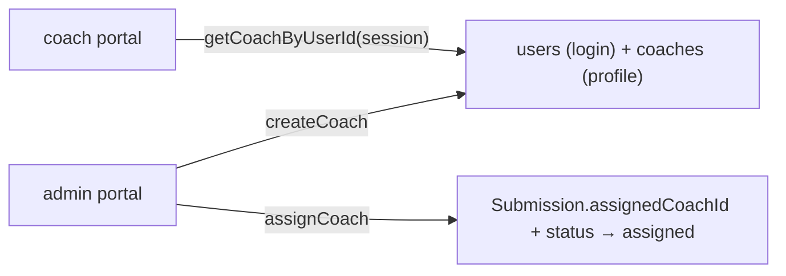

# operator — who logs in

## The northstar

`operator` is who exists as a person in the business and **which roles they
hold** — the subject the portal is run by. Three roles: **admin** (the admin),
**coach**, and **translator**, and one person can hold **several at once**: an
admin who also coaches, a coach who translates their own submissions.

**Customers never get an operator row** — they're identified by the email on
their submission, not a login.

**A role is a grant, not a column.** Each role a person holds is a row in
`operator_role_grant`, and that row carries everything that role decides — its
availability, its languages, its specialties, whether it wants the mail it
generates, and (for a coach) its bio and photo. The three roles ask different
questions with the same fields, so the answers live per grant rather than once
per person (the "three magisteria", 2026-08-30 — see below). The `operator` row
itself is now just identity: `{ id, email, name, isActive }`.

**Signing in is `account`'s job, not this slice's** (the 2026-08-06 folder
split, below). `login` / `logout`, the session, and the `requireSession` /
`requireRole` guards all live in `domains/account`. The session it issues
carries **`roles` — the whole set** (`OperatorSession = { operatorId, roles }`),
so a guard never re-reads the database to ask a second time. What stays here is
the operator record, the role grants, and the admin verbs that create, edit,
assign, and remove people.

Invariants:

- The DAL (in `account`) is the **secure** check, close to the data, and it
  re-reads each request's **live** grants — a revoked role or a suspended
  account takes hold at once, not when the week-long token expires.
- `proxy.ts` is only an **optimistic** check; never the sole line of defence.
- A wrong-role operator is redirected to *their* portal — or to the chooser
  (`/portal`) if they hold several — not to `/login`; they are authenticated,
  just in the wrong place.
- **The platform must always have one admin.** Revoking the last admin grant,
  deactivating the last admin, and deleting the last admin are each refused — a
  zero-admin state has no in-app recovery.

## Where we are — 2026-08-30

**Roles are grants, and a person is the sum of them.** This is the shape the
older sections below predate. The rebuild landed in two steps:

- **2026-08-07 — one role became many.** `operator.role` (a single column) became
  `operator_role_grant` (one row per role held), and the session grew from `role`
  to `roles`. A changed session shape signs everyone out once, which is the safe
  direction: an old cookie carrying `role` fails the shape check
  (`isOperatorSession`) and reads as no session. The first cut of that check
  failed *open* — an old cookie verified and arrived with `roles` undefined,
  500ing `/admin` for everyone holding one — which is why the shape is now
  verified, not assumed.
- **2026-08-30 — the three magisteria.** `languages`, `specialties`, `bio` and
  `imageUrl` moved off the person and onto the grant (migration `0026`). One
  person had one list, so a coach who read English and Japanese was necessarily a
  translator who worked *between* them — the same value standing in for two
  different questions. A coach's languages decide whether a submission needs
  translating; a translator's are a **direction** (English to Japanese / … / both
  directions); an admin has none. Different facts, so they live per grant.

Built on that this session (QA phase 5.13, PRs #59–#77):

- ✅ **One card per role** (`OperatorRoleCard`), each owning only what that role
  decides, saved independently so a stale submission can't strip the roles it
  forgot to mention. The languages control is role-aware — a coach picks a **set**
  (English / Japanese / Both), a translator a **direction** — and both are
  `<select>`s sized by an explicit height (`selectClass`), because a native select
  ignores `py-*` in WebKit and came out thin (5.13.4). The **create** form
  (`OperatorProfileForm`) got the same role-aware dropdowns; it had been radios
  offering only the coach vocabulary (5.13.4).
- ✅ **Onboarding email** (`operatorWelcomeEmail`) — creating an operator, and
  newly granting a role to an existing one, sends a best-effort message naming the
  role, linking to `/login`, nudging "Forgot password" (no secret rides along).
  Fired per role from `saveRoleAction` only when the role is *newly* granted; a
  pause, unpause or settings re-save sends nothing, a re-grant after a revoke
  sends again (5.13.2 / 5.13.4 / 5.13.5).
- ✅ **An admin can mute their own notifications** — a `notify` flag on the grant
  (migration `0027`) and a toggle on the admin card. Kept separate from `isActive`
  (which login reads as authority, so muting could never ride on it) and from the
  shared `contact@` inbox, which stays on every notice; `listAdminEmails` drops a
  muted admin (5.13.6.2).
- ✅ **Delete an operator outright** (`deleteOperator` + a danger zone on the edit
  page). It frees and requeues their work first (see `submission`'s
  `releaseAndRequeue`), drops their photo blobs, then deletes the operator row —
  grants and credential cascade, the trail keeps its rows with a null actor.
  Guarded against deleting the last admin, and against deleting your own account
  (5.13.11).
- ✅ **A revoked or paused operator returns their work to the queue** —
  `saveRoleAction` and the deactivate path call `releaseAndRequeue`, dropping each
  freed submission back to the rung its now-vacant leg is assigned from (5.13.8.1;
  the rule lives in `submission`).
- ✅ **The Operators list is one list, filtered by tab**, and keeps everyone: an
  operator revoked to no roles stays on **All** (the tab left-joins the grants)
  with a "no roles" pill until actually deleted, and a **No role** tab filters to
  exactly them (5.13.1 / 5.13.9). Each row shows languages and specialties **per
  role**, and the "needs …" prompt is computed per grant, so an admin-and-coach
  is no longer told the empty admin grant "needs languages" while the coach's sit
  filled in beside it (5.13.1).
- ✅ **The coach photo field** shows a thumbnail, a way to remove it back to none,
  and a button-styled picker; `saveRoleAction` grew the third outcome — upload
  replaces, tick removes, empty keeps — dropping the old blob either way
  (5.13.6.9).
- ✅ **Multi-role operators can switch portals and see their login email** — the
  portal bar keeps a "Switch role" button and shows the signed-in email under
  Account (that UI lives in `app/` and `account`, QA 4.7 / 4.16).

The dated sections below are the road here, kept because the argument was worth
recording — but where one of them describes `role` as a column, or the session as
carrying a single `role`, this section is the correction.

## The folder split — 2026-08-06

**Done.** `domains/account` exists; this slice no longer holds a password, a session, or a login
form. What follows is the reasoning, kept because the argument was wrong twice before it was right.

The first answer was that the folder *could not* split, because `listCoaches()` reads `operator` and
`operator_profile` in one query. **That part is still true** — it binds *the record* to *the
profile*, and no API boundary survives a join.

It said nothing about authentication. **Authentication joins nothing** — it reads one column,
`passwordHash`. The only thing holding it in this slice is that the column sits on the operator
table, and that is a schema decision rather than a law. Stated as a constraint twice, it was an
assumption both times.

Three concerns live here, not two:

| | is | owns |
| --- | --- | --- |
| **the account** | the ability to sign in | `password_hash` — today a column, and it should be its own table |
| **the operator** | a person in the business | `operator` — id, email, role, name, isActive |
| **the profile** | what they can be given | `operator_profile` — languages, specialties, bio |

The account and the operator are genuinely different nouns: **a coach can exist before anyone
gives them a login**, and `role` is a business fact while `password_hash` is an account fact. One
table holds both.

Splitting `password_hash` into `operator_credential` is better schema regardless of folders —
today every `SELECT *` on an operator carries a hash into memory for a column almost nothing
reads. And once it is its own table, `domains/account` owns it and breaks no rule.

The migration is `0013`, and it is applied. The seam that file boundaries used to carry is a folder
boundary now:

| | Where it went | |
| --- | --- | --- |
| the password, bcrypt, the session, the guards | **`account`** | none of it is in this domain any more, in any file |
| login, logout, change-password, forgot-password | **`account`** | including all four forms |
| `HOME_FOR_ROLE`, `OperatorSession` | **`account`** | where signing in sends you, and what a session carries |
| `ROLES`, `Role`, `CAN_BE_ASSIGNED` | **stayed** | a role is a kind of operator, not a permission — see the entry below |
| the operator record, profiles, coaches, translators, assignment | **stayed** | this domain's actual subject |

`CAN_BE_ASSIGNED` is still an exhaustive `Record<Role, boolean>`, so a fourth role is a compile
error here rather than a silent default.

The general lesson is now [`laws/_StructureLaw.md`](../../../laws/_StructureLaw.md) §5b: a constraint that arrives
from the schema deserves one round of *why is the schema like that* before it is written down as
an architectural conclusion.

## Coach and translator get their own files — 2026-08-06

> **Partial.** This separated the two roles' *verbs* and left the shared *shape* named for one
> of them. `Coach` is a role, not an entity — see `_NomenclatureLaw.md` §4 — and until it is
> renamed, `translatorApi` importing it is the tell that the job is half done.

For one day, `coachApi.ts` held `listTranslators()` and `coachActions.ts` held
`assignTranslatorAction`. A file named for one role holding another role's verbs
is the one-stem violation `_NomenclatureLaw.md` §2 exists to catch, and it
matters more here than usual: **the two roles are genuinely similar**, which is
exactly when a reader needs the filename to say which one they are looking at.

Now:

```
operatorProfileApi.ts   the join + the role filter — what coach and translator share
coachApi.ts             coaches
translatorApi.ts        translators
translatorActions.ts    the admin picking one
```

`profileQuery()` is private to `operatorProfileApi`. The two role files call
`listByRole` / `getByRole` and never touch a table, so the join has one home
even though three files depend on it.

**The role filter is explicit, and that was a bug fix.** The join alone used to
be the filter — an admin has no profile, so with two roles "has a profile" and
"is a coach" were the same set. A translator broke it: they carry languages too,
so every translator would have appeared in the coach dropdown. A shape that
happens to filter correctly is not a filter; it is a coincidence with a shelf
life.

## The password stops at one file — 2026-08-06

`api/operatorApi.ts` split in two. The record — `listAdminEmails`,
`getOperatorById`, `findOperatorByEmail` — stayed. Everything that touches the
stored hash moved to **`api/credentialApi.ts`**, which is now the only
file in `src/` that reads or writes `credentialTable.passwordHash`, and the only
one in this domain that imports bcrypt. One grep confirms it, which is the
whole reason the split is worth its two files:

```
grep -rn "passwordHash" src/
```

Three things fell out of doing it rather than just asserting it:

- **`createOperator` moved to the credentials side.** It reads like a record
  function, and the alternative was exporting a `hashPassword` helper for the
  record side to call — but a hasher that leaves the file can be called from
  anywhere, which is the containment traded away for a tidier filename. Creating
  an operator row *is* minting a credential; the parts of a person that aren't a
  login live on `operator_profile`, created by `coachApi.createCoach`.
- **The forgot-password flow was the one real exception.** It reads a 24-char
  slice of the hash to bind its emailed link, making the link single-use with no
  schema change. That survives as `passwordFingerprint()` — the slicing happens
  behind the boundary and the caller gets a string it can only compare.
- **`setUserPassword` → `setOperatorPassword`.** `user` is a retired word
  (`_NomenclatureLaw.md` §3); this was the last live one in a function name.

The four credential functions also came **off the barrel**. None had ever been
imported from outside the domain — the three callers are neighbours and reach
them relatively. Exporting them published a password-setting function to the
whole app on the strength of nobody having called it yet.

## The slice owns its storage — 2026-08-05

`operator` and `operatorRole` are declared here now — `model/operatorTable.ts` and
`model/operatorRoleEnum.ts` ([ADR 015](../../../docs/decisions/015-schema-by-domain.md)).
The enum **derives** from `ROLES` in `model/operator.ts`, which is also where
`type Role` comes from: one list, two consumers. `Role` used to be a bare union
spelled a second time in the schema.

**This slice is the home for operator identity, and there is no `domains/user/`.**
A second folder for the same concept is the one-stem violation
`_NomenclatureLaw.md` §2 exists to catch. Two other tables reference this one
directly — `submissionAssignmentTable` (who owes a file) and
`submissionEventTable` (`actorId`, null for the customer and the cron).

## Where we are — 2026-08-01

- ✅ **`listAdminEmails()`** — where operator notifications go, read from the
  `operator` table rather than an env var. The people who should hear about a stalled
  hand-off or a new payment are exactly the people who can log in and act on it,
  and a config value would let those two drift the moment an operator changes.
  Distinct from `site.email` (the public address) and `EMAIL_FROM` (who mail is
  sent *as*) — three jobs, three sources.

  Returns **every** admin, so a second one is added by creating a user rather
  than by a deploy. Empty is survivable: the caller skips the send, because
  nobody being told is better than a crash inside a webhook.
- ✅ **Forgot-password** for operators (Aaron, 2026-08-01) — a one-hour reset
  link. ⚠️ It joins the verification code as a message whose recipient is
  **blocked** on it, which ADR 004's best-effort default serves badly. Two
  instances is a pattern worth deciding about.

## Where we were before that

- ✅ `login` / `logout` server actions, credential check against Postgres
  (bcrypt), signed session cookie.
- ✅ `requireSession` / `requireRole` DAL guards; `proxy.ts` optimistic routing
  for `/admin`, `/coach`, `/login`.
- ✅ `LoginForm` + `/login`; stub `/admin` and `/coach` landing pages behind the
  guards.
- ✅ First admin seeded by `npm run db:seed`.
- ✅ `createOperator` is wired to the admin coach-management screen (creates a
  `operator` + `coach` pair).
- ✅ **Change password** at `/account` (any signed-in operator) — verifies the
  current password, then updates the hash. Covers the seeded-admin gap.
- 🔶 **No forgot-password (unauthenticated email reset) yet** — it needs a reset-token
  flow and a verified Resend domain. Change-password (authenticated) covers the
  urgent case for now.

## Where we came from

- **2026-07-29** — Built as part of the operator-portal pivot
  ([ADR 007](../../../docs/decisions/007-portal-and-postgres-retire-airtable.md)).
  Chose a first-party `jose` session + DAL over Auth.js
  ([ADR 008](../../../docs/decisions/008-jose-sessions-over-authjs.md)): Next 16.2
  is bleeding-edge, Auth.js v5 is beta, and we need only credentials + two roles.
  Less code, no beta dependency. Auth.js stays the documented exit if we later
  need OAuth or magic links.

---

# The coach, absorbed — 2026-08-06

`domains/coach` dissolved into this slice (ADR 018 §5). A coach is an operator with
a profile, so once the `coach` table went its queries were reading *this* domain's
tables from another folder — a dependency violation that only existed because the
slice used to own a table. What follows is its documentation, kept whole.

The **coach domain slice** — the people who review submissions, and the admin verbs for
managing them and assigning work.

---

## 1 · The northstar

A `Coach` is a reviewer's profile (name, specialties, languages, active) **plus a login** —
the `coach` row is keyed to an `operator` row by `operatorId`. the admin creates coaches from the admin
portal (there is no self-signup) and assigns each submission to one.



### The invariants

- **A coach is two rows, made together.** `createCoach` calls the account domain's
  `createOperator` for the login, then inserts the `coach` profile — one is useless without
  the other.
- **Both verbs are admin-only**, re-checked with `requireRole("admin")` in the server action,
  never trusted from the UI.
- **Assignment moves the status to `assigned`** — one call, so the queue state and the
  ownership can't disagree.
- **The coach portal finds *its* coach by the session's `operatorId`**, never by a client-supplied
  id.

### The pieces

- `api/coachApi.ts` — `listCoaches`, `getCoachByUserId`, `createCoach` (the only `coach`
  reader/writer).
- `api/coachActions.ts` — `createCoachAction`, `assignCoachAction` (server actions).
- `ui/AddCoachForm.tsx` — the admin's add-coach form.
- `model/coach.ts` — `Coach`, `NewCoach`.

---

## 2c · The slice owns its storage — 2026-08-05

`coach` is declared here now, in `model/coachTable.ts`, rather than in a
shared schema file ([ADR 015](../../../docs/decisions/015-schema-by-domain.md)).
It imports two declarations from other domains — `operatorTable` (the login it's
paired with) and `focusEnum` (the vocabulary `specialties` draws on, owned by
`submission`, which already owned `FOCUS_OPTIONS`). Both are direct file imports,
never barrels: a foreign key can't route through one without closing a cycle.

## 2b · Fixed 2026-08-02

- 🔴 **The hand-off refused translated submissions.** `notifyCoachAction` only
  accepted `assigned`, but a translated intake sits at `intake_translated` — so
  the button appeared, the action returned, and nothing happened. Silently, for
  exactly the submissions that needed translating. Found by simulation, not by
  review.

## 2 · Where we are now — 2026-08-01

**Phases 3–4 of the rollout landed here.**

- ✅ **The hand-off stops at `sent_to_coach`.** Emailing a coach is not the same
  as a coach starting work, and the gap between them is the one place a
  submission stalls on a person outside the building. the admin can now see it.
- ✅ **`noteCoachCollected`** — the coach's first download earns `in_review` and
  tells the admin the hand-off closed. Gated on it being **that coach's** submission:
  the download route can only see that *a* coach is logged in, and an admin
  checking on the work must not count as the coach starting it.
  Fire-and-forget and self-swallowing, because it hangs off a route whose real
  job is delivering bytes.
- ✅ **`coaches.languages` is one half of the translation rule.** The rule itself
  lives in `domains/submission`, because it needs both halves: a submission needs
  translating exactly when the customer's declared languages and this coach's
  **share nothing**. English is no longer privileged — a Japanese-reading parent
  paired with a Japanese-reading coach needs no translation, which the old
  coach-only derivation got wrong.
  **Unknown is not the same as no**: either side blank returns `null`, and the
  queue names *which* side is blank, since the fix differs.
- ✅ **The hand-off carries a language choice** (step 8's radio) and records what
  was actually sent. The radio can't live on assignment — at that point the
  translation doesn't exist to choose.
- ✅ **Reassignment is guarded server-side**, not just hidden: a stale tab could
  previously pull a submission out from under a coach who had already been
  emailed it.
- ✅ **Languages are a radio choice — Japanese · English · Both**, defaulting to
  Japanese, on both the add and edit forms. It replaces a comma-separated text
  box that could be **left empty**, and empty is the one input the translation
  rule can't answer: it returns `null` and the queue reports "no languages
  recorded" instead of routing the submission. One option is always selected, so
  that state is now unreachable from the form — and `readLanguageChoice` falls
  back to the default server-side, so it's unreachable from a tampered post too.
  **Both is a real answer, not a convenience**: a bilingual coach reads whatever
  the customer declared.
  The cost is that a third language now needs a code change rather than typing
  it into a box. Worth it while `LANGUAGES` is two — revisit it when it isn't.
- ✅ **Existing coaches were backfilled to English** (migration `0014`). Every
  coach on record predates the question and every one of them reads English —
  that was the platform's own assumption until the intersection replaced it.
  Only blank rows are touched, so it can't undo a coach deliberately set to
  Japanese only.
  **`submissions.languages` is deliberately *not* backfilled**: a coach's
  profile is the admin's to state, a customer's declaration is not ours to invent.
- ✅ **The dev seed carries all three language shapes** — bilingual, Japanese
  only, English only. The bilingual one is the case worth having: a rule written
  as "do the sets match?" instead of "do they overlap?" passes both
  single-language coaches and fails only there.


### Before 2026-08-01

- ✅ **Create a coach** from `/admin/coaches` — login + profile, specialties, languages.
- ✅ **Assign a coach** to a submission from the admin queue, moving it to `assigned`.
- ✅ **`getCoachByUserId`** backs the coach portal's "my assigned submissions" view.
- ✅ **Edit a coach** at `/admin/coaches/[id]` — name, specialties, languages, and the
  `isActive` toggle (an inactive coach still shows in the assign dropdown; hiding them there
  is a small follow-up).
- 🔶 **No delete** — a coach can be deactivated but not removed (their assignments would
  orphan). Reassignment is by picking a different coach on the queue.

---

## 3 · Where we came from

**2026-07-29 · Created with the operator portal** ([ADR 007](../../../docs/decisions/007-portal-and-postgres-retire-airtable.md)).
Under Airtable, "Assigned Coach" was a free-text field the admin typed into and there was no coach
concept in code. The portal made coaches real: a login, a profile, and referential
integrity via `assignedCoachId`.
