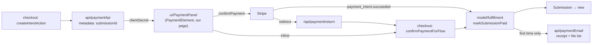

# payment — `src/domains/payment/`

The **payment domain slice** — paying for a review. Almost entirely **verb**: there is no
Payment record of our own. Stripe holds the money and the truth about it; what we persist is
a submission carrying the payment's id.

---

## 1 · The northstar

Money clearing is the **last** step of the flow, not the first. By the time this slice runs,
the submission exists, the email is verified, and the files are in. It owns that moment and
nothing after it.

### The invariants

- **All four steps live on ONE route**, now owned by the `checkout` slice. Same reasoning as
  when there were two: it keeps the client secret in memory instead of a URL, and a full page
  navigation between steps would reintroduce exactly the seam ADR 005 paid to remove.
- **`markSubmissionPaid()` is idempotent, and has two callers** — the webhook and the
  browser's own confirmation. Whichever arrives first flips the status; the other finds it
  done. This is what makes the race between "customer came back" and "webhook delivered" a
  non-event rather than a bug. *(See [ADR 003](../../../docs/decisions/003-shared-idempotent-fulfillment.md);
  it inverted with the flow but the contract is unchanged.)*
- **Any future path that marks a payment must go through it.** A second site reintroduces the
  race and the double-receipt.
- **The receipt is gated on `justPaid === true`**, so Stripe retrying a webhook can't send a
  second one.
- **Payment is verified against Stripe, never against our own row.** The row could be stale,
  and the session id arrives from the browser.
- **`receipt_email` is set** so Stripe issues its own card receipt; ours is the one that
  lists the files.
- **`redirect: "if_required"`.** Plain cards confirm without leaving the page; only methods
  that demand a redirect (3-D Secure, wallets) take the return trip. Without this every
  payment would bounce out and back.
- **A `processing` intent is neither claimed as success nor as failure.** The customer is
  told it's still clearing and that we'll email — because that's what's true.
- **Metadata carries only `submissionId`.** It used to carry the whole player record,
  because the row didn't exist yet and fulfillment had to rebuild it from what Stripe echoed
  back. With the row created at step 1 that's no longer true, and one id is both smaller and
  safer — Stripe never holds the customer's notes, and there is nothing to re-validate on the
  way back.

### The pieces

- **the VERB** — `api/paymentApi.ts` (create a PaymentIntent, verify a succeeded one —
  and, since QA 2.4.3, verify a *declined* one for the browser's decline report) ·
  `api/paymentWebhook.ts` (verify Stripe's events, act on them) ·
  `model/fulfillment.ts` (intent → paid submission, idempotently) ·
  `api/paymentCompletion.ts` (what happens once it clears — written once for both callers) ·
  `ui/PaymentPanel.tsx` (step four — Elements on our own page) ·
  `api/paymentEmail.ts` (the receipt, with the file list).
- The flow's orchestration and step one moved out: `ui/SubmitFlow.tsx` became
  `domains/checkout/ui/CheckoutFlow.tsx`, and `ui/PlayerInfoForm.tsx` moved to
  `domains/submission/ui/`, which is what it collects.
- No `model/` type: **the noun lives in Stripe.** A slice that's all verb is legitimate
  (PRINCIPLES #4).

---

## 2 · Where we are now — 2026-08-29

- ✅ **The decline path now has two callers, like the success path** (QA 2.4.3).
  `markSubmissionPaid` has had two callers since ADR 003 (the webhook and the
  browser confirming inline), so a payment records even when the webhook is down.
  Failure had only the webhook, so one disabled or misdirected endpoint silently
  removed the entire card-declined recovery email. `getFailedPaymentIntent`
  mirrors `getSucceededPaymentIntent` — it returns an intent only if it genuinely
  declined (`last_payment_error` present, not succeeded/processing), verified
  against Stripe — and `checkout`'s `reportDeclineAction` calls
  `handleFailedPayment` from the browser. `PaymentPanel` fires that report only on
  a `card_error` (a blank-field validation slip carries no intent to decline).
- ✅ **One decline email per intent, across both callers and any Stripe retry.**
  `handleFailedPayment` now guards on `declineEmailedFor(submissionId, intent.id)`
  before sending, and the intent id rides in the trail note so the dedupe has
  something to match on. Without it the webhook and the browser report would send
  two "your card was declined" emails for one decline.

### 2026-08-01

- ✅ **A declined card is handled, not just logged.** `handleFailedPayment` emails
  the customer a way back in and **touches the row** — which is what extends the
  abandonment window, since the sweep measures from `updatedAt`. Recording the
  decline *is* the extension; that's why it's a write rather than a log line.
  Guarded on paid-ness, so a decline arriving after a successful retry can't
  disturb a submission that has since gone through.
- ✅ **② goes to the admin as well as the customer.** A queue that doesn't announce its
  own arrivals has to be watched instead of used. Gated on `justPaid` like the
  receipt, so a redelivered webhook announces nothing twice.
- 🔶 **The decline email is deliberately vague about the reason.** Stripe's own
  wording is shown inline on the page where it's actionable; repeating
  "insufficient funds" in an email that may be read over someone's shoulder isn't
  our call to make.

### Before 2026-08-01

- ✅ **Stripe Elements on our own page**, now as step 4 of 4 — details, verification, files,
  then payment in place. Our layout, our order summary (which names the file count), our
  domain.
- ✅ **Rendered and confirmed in a browser 2026-07-30**: reaching step 4 loads the
  `<PaymentElement>` iframe and the button reads `Pay CA$80.00`. That closes part of the gap
  flagged below — the card *field* renders. Actually entering a card and clearing 3-D Secure
  still needs a human.
- ✅ **Verified against real Stripe 2026-07-29** (test mode, via `npm run payment`):
  `createPaymentIntent` → confirmed with `pm_card_visa` → `succeeded` →
  `getSucceededPaymentIntent` ✓ (and `null` for a bogus id) → signed webhook 200 → the
  submission row correct in every field → **re-delivery produced no duplicate**. (The webhook
  now writes that row to **Postgres**; the fulfillment logic verified here is unchanged.)
  A declined card (`pm_card_chargeDeclined`) created **no row**, which is the important
  negative: a failed payment must never look like a submission. A 3-D Secure card returned
  `requires_action`, correctly.
- 🔶 **A real card and the 3-D Secure modal are still unverified.** The field renders; that a
  human can type into it and clear an authentication challenge needs a human. **That's the
  remaining gap in this slice.**
- 🔶 **The redirect return path is untested end to end.** `/api/payment/return` is wired and
  type-checked, but only a 3-D Secure card in a browser exercises it.
- 🔴 **`NEXT_PUBLIC_STRIPE_PUBLISHABLE_KEY` must be set in Vercel** or the deployed payment
  step renders a "payments aren't configured" notice instead of a card field.
- 🔴 **The live-mode webhook endpoint doesn't exist yet.** A test endpoint was created
  (`we_1TyhuB…`, correct events); live mode is a separate object with a different secret and
  needs the live key.
- ✅ **Idempotent fulfillment**, shared by both entry paths (webhook, browser).
- ✅ **The receipt email** — amount, total, and every file by name and size, with the
  customer's own filenames HTML-escaped on the way in.
- ✅ **Inline pricing from the operator's setting** (`settings.priceCents`, edited at
  /admin/settings) when `STRIPE_PRICE_ID` is unset, so the client needn't create a Stripe
  Product to launch and can reprice without a deploy. The receipt falls back to the same
  setting rather than the `site.ts` constant, so a missing `stripeAmount` can't mail a
  figure the operator retired.

- ⚠️ **`npm run payment` now creates a submission first.** Payment is last, so there has to
  be something to pay for; the probe stands in for the three steps a real customer walks.

---

## 3 · Where we came from

**2026-07-30 · Payment moved last** ([ADR 009](../../../docs/decisions/009-upload-before-payment.md)).
The slice's whole premise inverted.

- **`ensureSubmission` became `markSubmissionPaid`.** It used to *create* the row from
  metadata, because payment was the first thing that happened. The row now already exists —
  the customer filled it in at step 1 and attached files at step 3 — so this marks it paid.
  ADR 003's contract survives untouched; only the direction changed.
- **Metadata shrank to one id**, and with it the whole `submissionFromPaymentIntent`
  re-validation dance: there is nothing to rebuild any more.
- **The email changed job.** "We took your money, now go upload" was an instruction because
  payment came first. Now it's a confirmation: a receipt listing what we already have.
- **`paymentCompletion.ts` appeared** so the webhook and the browser share one definition of
  "what happens after it clears", rather than each remembering to send the receipt.
- **The orchestration left.** A flow spanning four domains inside `payment/` would have made
  this slice the de-facto owner of the customer journey; it moved to `checkout`.

**2026-07-29 · Postgres cutover.** Unchanged in shape: `ensureSubmission` and the webhook
kept their signatures, so this slice barely moved. What changed underneath is that
`createSubmission`/`findByStripePaymentId` now hit Postgres instead of Airtable, and
`fulfillment` writes status `awaiting_upload` (lowercase enum) with the amount in cents. The
idempotency and verify-against-Stripe invariants are exactly as before.

**Before 2026-07-28**, this slice was four files in four folders: `lib/stripe.ts`,
`lib/fulfillment.ts`, `app/api/checkout/route.ts` (which held the session-building logic
inline), and `app/start/start-form.tsx`. To see "everything about payment" you opened all
four, related only by the reader's memory. Step 2 collected them.

Decisions taken, with their reasoning:

- **`ensureSubmission` extracted and given two callers** — from the original build. The
  alternative was blocking the customer behind a poll-and-wait spinner until the webhook
  landed. Making the operation idempotent removed the ordering requirement entirely instead
  of handling it.
- **Verify against Stripe, not Airtable** — from the original build. CLAUDE.md §7 had
  specified checking our own row; verifying upstream is strictly stronger and costs one API
  call. The spec was amended.
- **Elements shipped (Step 5, 2026-07-29).** `Stripe Payment ID` needed no migration, exactly
  as ADR 005 predicted — the column was named for the role rather than the Stripe object, so
  it simply started holding a PaymentIntent id. `checkoutApi.ts` became `paymentApi.ts` and
  `/api/checkout` became `/api/payment/intent`, since "checkout" now names a Stripe product
  we no longer use.
- **`NEXT_PUBLIC_STRIPE_PUBLISHABLE_KEY` went to a new `shared/config/publicEnv.ts`**, not
  `env.ts`. A client component importing `env.ts` would pull a module of secret getters into
  the browser bundle — harmless today, and exactly the thing that stops being harmless after
  one more getter is added. The invariant is now "`process.env` is read only in
  `shared/config/`", split by audience.
- **Elements over hosted Checkout (2026-07-28, Ben).** Hosted Checkout is *not* unbranded —
  Stripe's dashboard carries a logo, colours, and fonts. The argument that decided it was
  that hosted Checkout is a full-page handoff to another domain: we control neither the
  layout, the surrounding copy, nor the URL bar. For a service asking a parent to pay $149
  up front to strangers overseas, the moment of payment is where trust is won or lost.
  Rebuild pending. *(Full reasoning: [ADR 005](../../../docs/decisions/005-stripe-elements-over-checkout.md).)*
- **Webhook verification and handling moved out of the route (Step 2b).** The route had been
  holding signature verification and `handleCheckoutCompleted` — what a completed checkout
  *means*, sitting in the app layer. `app/api/` can't move (Next.js makes the path the URL),
  but its contents can: it's the composition root now, and the route is 30 lines.
- **Checkout logic lifted out of the route handler (Step 2).** The route now owns HTTP —
  parsing, status codes — and the domain owns what it means to charge for a review. Routes
  are compositions, not homes.
