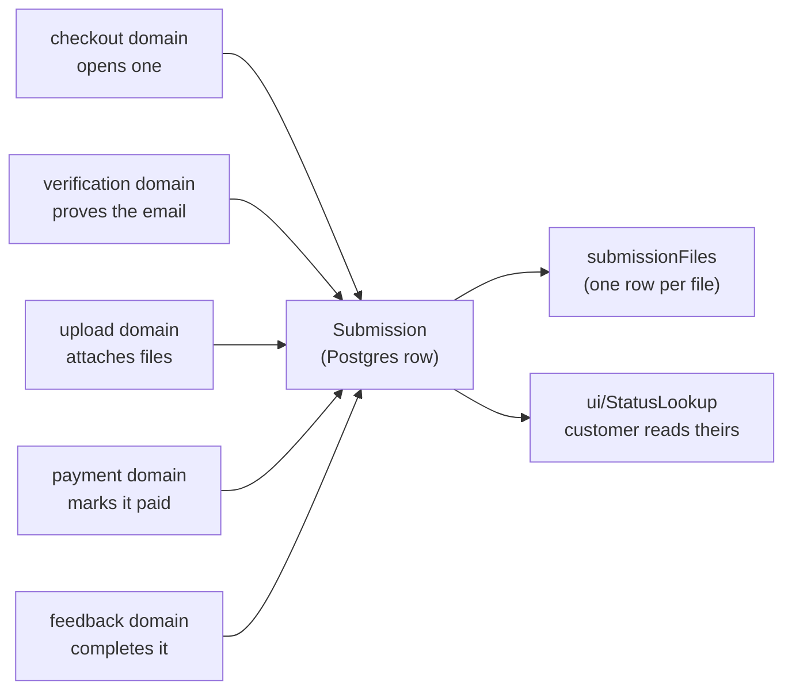

# submission — `src/domains/submission/`

The **submission domain slice** — one folder holding both what a Submission **is** (the noun)
and what a customer **does** with it (looks theirs up). One request for coaching feedback:
the record every other domain orbits.

---

## 1 · The northstar

A submission is **one request for coaching feedback, carrying a pack of files** — not one
video. A customer attaches whatever shows the problem: a clip or two, a still of their grip,
a PDF from a previous coach. Up to `maxFilesPerSubmission`, each up to `maxFileSizeMb`, both
set by the operator. One payment buys one *review of the pack*, and the coach answers it with
a single response.

That plural is the shape of the data, not a detail: it's why `submissionFileTable` is a table and
not a column, and why anything phrased as "the video" is a bug in the making. The single
`videoUrl` field this replaced could only ever hold one locator.

It is created at the *first* step of the flow — before verification, before files, before
money — and it accumulates: the proof of email, then the files, then the payment, then the
coach's response. Its `status` is the whole workflow in one field, and **[§2 · The northstar
path](#2--the-northstar-path--inception-to-completion) is the canonical account of that
journey** — read it before changing any stage.

**Nothing is retained until the payment clears.** Before that a submission is a scratch pad:
a refresh, a ten-minute idle timeout, or "Start over" discards it — files and record together
(`discardUnpaidSubmission`). Only a paid submission earns a place in the queue, and only a
paid one is safe from being scrubbed.



**This slice imports no other domain.** Verification, upload, payment, feedback and checkout
all import *it*. That asymmetry is the architecture: arrows point at the record, and the
graph can't cycle.

### The invariants

- **The storage column names live in the Drizzle schema (`shared/db`), and the row↔domain
  mapping lives in `api/submissionRow.ts`.** No other file turns a DB row into a Submission.
  A schema change is a Drizzle migration. *(PRINCIPLES #2.)*
- **Email is normalized to lowercase on write and on lookup**, so a customer who checks out
  as `Alex@x.com` and later looks up `alex@x.com` finds their own submission.
- **One schema validates on both sides.** `model/submissionInput.ts` holds the Zod schemas;
  the client form and the API route use the same objects, so they cannot drift into
  disagreeing about what's acceptable. **The server always re-validates** — client validation
  is a courtesy to honest users, not a boundary.
- **Email is normalized *before* it's validated**, not after. A trailing space from a mobile
  keyboard's autocomplete would otherwise be rejected as an invalid address.
- **`PublicSubmission` is the only shape that leaves the building.** The lookup identifies
  customers by an *unverified* email, so anything on that type is visible to anyone who
  guesses an address. Adding a field to it is a security decision, which is why it lives
  here rather than in the route that serializes it.
- **`status` and `focus` are Postgres enums**, so the DB itself rejects a bad value — no
  runtime guard needed the way the Airtable single-selects required one.
- **The customer-facing flow writes only `draft`, `awaiting_payment` and `new`.** The other
  three are driven from the operator portal, expressed as `AppWrittenStatus`.
- **The flow cookie carries a submission id and nothing else.** Whether the email is verified
  lives on the row, so a stale cookie can't claim a verification that never happened
  ([ADR 010](../../../docs/decisions/010-verification-gates-upload.md)).
- **A file record outlives its bytes.** The retention sweep clears `fileUrl` and leaves the
  row, so the portal and the receipt can still say what was sent. `isAvailable()` is the
  honest way to ask.

### The pieces

- **the NOUN** — `model/submission.ts` (the type family, `SUBMISSION_STATUSES`,
  `FOCUS_OPTIONS`) · `model/submissionFile.ts` (one uploaded file) ·
  `api/submissionRow.ts` (the row↔domain mapper — the storage seam) ·
  `api/submissionApi.ts` and `api/submissionFileApi.ts` (the Drizzle queries).
- **the VERB** — `ui/PlayerInfoForm.tsx` (step 1 of the flow) · `ui/StatusLookup.tsx` (email
  in, your submissions out) · `ui/SubmissionFileList.tsx` (the operator's view of what
  arrived) · `api/flowSession.ts` (which submission this browser owns) ·
  `model/submissionInput.ts` (validating what a customer types) ·
  `model/publicSubmission.ts` (the trim-to-safe projection).
- `index.ts` — the barrel. Consumers import `@/domains/submission`.

The status lookup lives here rather than in its own domain because *checking your
submissions* is a verb over this noun, not a separate concept. That's PRINCIPLES #4 doing
its job.

---

## 2 · The ladder — inception to completion

**This is the canonical journey, and the single reference for it.** Every other
doc describes a slice; this is the whole arc, so a proposed change to any stage
can be checked against what comes before and after. Refine it here first.

### One block, one rung — restructured 2026-08-02

**A row here is a status, not a stage.** It used to be seventeen stages against
sixteen rungs, and the mismatch went stale exactly where you'd expect: *files
attached* was a stage with no status of its own, so one block had no home and one
rung silently carried two jobs. That's how a customer mid-upload came to show as
"awaiting payment".

So the unit is now the **rung**, and everything a customer or operator *does*
while sitting on it is inside that rung's chain. Uploading isn't a stage that
follows verification — it's what rung 2 **is**.

**The chain is written as work, not as narration.** It used to describe a rung as
though it had already happened — *"the submission is created"* — which reads
wrong on the one place a submission is actually sitting. Every step is now
something **to do**, and exactly one cell per rung is written as finished: the
**Done when** column, which is the condition that *ends* the rung rather than
another task. Everything left of it is outstanding.

That's also why *Leaves on* became *Done when*. It was a fact about the rung
filed away in a corner; it's the closing line of the story the row tells.

Two things follow, and both are improvements:

- **The doc and the queue agree.** The admin row renders exactly this: the rung,
  then its chain. Two descriptions of one process was the drift.
- **⚠️ Rung 2 needs renaming.** `awaiting_payment` is the name of its *second*
  half; the customer spends most of it uploading. **`uploading`** is proposed
  here and not yet migrated — an enum rename is a migration to fix a label, and
  the label is what was wrong. It reads **"Upload pending"** now, sharpening to
  "Uploaded N — awaiting payment" once files have actually landed, at which
  point payment really is what we're waiting on.

**It describes the northstar, not the build** — and as of 2026-08-01 the two have
converged. Every stage below has code behind it, verified by probe rather than by
inspection, so the table carries no *(not built)* or *(today: …)* notes for the
first time.

That is a moment, not a property. The convention stays: a cell states where the
step is going, in present tense, and a divergence is an **appended note** rather
than a softened sentence. The next thing that ships ahead of this doc, or lags
behind it, gets marked the same way.

### How to fill a row

Six rules. They exist because each was got wrong at least once while the table
was being written, and each mistake was invisible until it was named.

1. **A row is a move, not a state.** If you can't name a trigger, it isn't a row —
   it's a condition, and it belongs in someone else's *Before* or *After*.
2. **Trigger is the pivot.** Everything left of it is already true when the stage
   begins; everything right of it is caused by it. **A fact on the wrong side of
   that column means the row is wrong** — which is a thing you can check by
   reading, not by knowing the code.
3. **State what is, not what isn't.** "Nothing exists yet", "not yet notified",
   "no session needed" describe absence. Say what *is* true instead. Absences are
   real and worth recording — they go in an audit's gaps layer, not in the path.
4. **Cells hold content, not navigation.** No "see below", no cross-references.
   If a cell can't hold the detail, the detail belongs in a section of its own and
   the reader will find it.
5. **Write the real names, never a paraphrase.** `startSubmissionAction`, not
   "the submit handler". `emailVerifiedAt`, not "the verified flag". These are
   the shared vocabulary between this table, the admin screen and the source, so
   a mismatch between the three is *discoverable by reading* — and the table
   earns its keep as a nomenclature check, not just a description.

   It cuts the other way too: **if a name needs explaining every time it appears
   here, the name is wrong in the code.** Nomenclature should carry meaning, not
   require it. (PRINCIPLES §11.)
6. **One scope per column.** Don't let a cell answer a neighbouring column's
   question; the overlap is where drift starts.
7. **Resolve the chain across the row — don't defer it to prose.** A trigger
   rarely does one thing. **① ② ③ …** are its operations *in execution order*,
   one per column, so a row read left to right is a complete cause-and-effect
   chain: who, in what state, under what conditions, does what — which causes
   this, then this, then this — ending in an outcome, a message, a retention
   answer and a status move.

   Say which operations can abort the stage and which fail silently; that
   difference is usually the interesting part. Stages have different lengths, so
   the later columns are often blank — see rule 8. **Width is not a constraint;
   an unresolved row is.**
8. **A blank cell is an answer, and it has to be a true one.** Blank means
   *nothing happens in this dimension at this point* — no email fires, no status
   moves, nothing is retained. Don't pad it with "—" or "n/a"; the emptiness is
   the information, and a column of blanks broken by one entry is exactly how you
   see where something actually happens.

   Blank is **not** the same as missing. Where something *ought* to happen and
   doesn't, mark it **⚠️** and say so. That single distinction is what keeps the
   table honest as it gets sparser: silence means "correctly nothing", ⚠️ means
   "a gap we know about". If you can't tell which a cell is, the cell is wrong.

   **The whole grid is the story — blanks included.** A row's meaning comes as
   much from the columns it leaves empty as the ones it fills.

   Keep the cell itself empty — the sparseness is what makes the pattern
   readable — and give the reason in one line beneath the table. Some blanks are
   incidental; others are a decision, and those are worth saying out loud.
9. **Write the chain as work, and close it once.** A rung is where a submission
   *is*, so its steps read as things to do — `Create the submission`, not *the
   submission is created*. Narration in the past tense makes an outstanding rung
   look finished, which is the opposite of what a progress view is for.

   Exactly one cell is written as complete: **Done when** — the condition that
   ends the rung. It isn't another task, and it isn't optional; a rung whose exit
   isn't stated is a rung nobody can tell they're stuck on.
10. **Write the northstar, not the current state.** Every cell describes the
   destination, in present tense — the version of this step we're building toward,
   whether or not it exists. That's PRINCIPLES §12: present tense is the
   northstar, and it's never about legacy.

   Reality is recorded as an **appended note**, never by softening the statement:

   | Marker | Means |
   | --- | --- |
   | *(today: …)* | the step exists but the code differs from the northstar |
   | *(not built)* | the step is agreed and nothing implements it yet |
   | ⚠️ | a gap in the northstar itself — something that *should* be decided or built and isn't |

   The reason for the separation: a doc that describes what the code happens to
   do can only ever justify the code. Stating the destination first means the
   difference between the two is visible in every row, and a divergence becomes
   a to-do rather than a description.

   Keep the cell itself empty — the sparseness is what makes the pattern
   readable — and give the reason in one line beneath the table. Some blanks are
   incidental; others are a decision, and those are worth saying out loud.

What each column holds:

| Column | Holds | Not |
| --- | --- | --- |
| **① ② ③ …** | one operation of the trigger, in execution order, marked if it can abort or fails silently | a summary — that's *Outcome* |
| **Outcome** | where the actor is left, and what is now possible | the mechanics — those are the numbered columns |
| **Stage** | a short phrase naming the move | a status value — that's the last column |
| **Who** | the actor whose action causes it | the system, unless genuinely nobody triggers it |
| **Before** | what is already true as the stage begins | anything the trigger causes; anything absent |
| **Viable when** | every condition that must hold at the instant of the trigger | why the condition exists — that's prose, not a cell |
| **Trigger** | the literal control pressed, or the event that arrives | what it causes |
| **Email** | which numbered message fires, or ⚠️ if none does | messages that *should* exist — mark those, don't imply them |
| **Retention** | whether the submission survives being abandoned at this point | |
| **`status`** | `from → to`, or *(unchanged)* | the destination on its own — the move is the information |

> **⚠️ This table is sixteen rungs; the ladder is now twenty (§2d).** ADR 018
> added a picking rung and a hand-off rung to *each* translation leg, and renamed
> the `response_*` rungs `feedback_*`. The arc and the reasoning below still hold
> — the translator legs simply expanded from one rung to three, the mirror of the
> coach's `sent_to_coach → in_review`. Read `SUBMISSION_STATUSES` for the current
> list; this table is being kept until it is rewritten against the twenty.

| # | Rung | Court | What it means | Enters on | ① | ② | ③ | ④ | ⑤ | ⑥ | Done when | Email | Retention |
|---|---|---|---|---|---|---|---|---|---|---|---|---|---|
| 1 | `draft` | customer | Details captured, nothing proven. A scratch pad | **“Continue to email verification”** → `startSubmissionAction` | Discard any earlier unpaid attempt — files and row | Tidy up stale abandoned submissions elsewhere *(best-effort; never blocks this customer)* | Create the submission and give it its permanent id | Open a **30-minute sliding window** — the only clock in the flow | Mint a 6-digit code; store only its hash | **Confirm the code was accepted for delivery** before advancing them, and record what became of it | **Done** when the customer enters the code | ① code → customer | scratch pad — discardable at any moment |
| 2 | **`uploading`** *(not built)*<br>*(today `awaiting_payment`)* | customer | **The address is proven and the upload gate is open.** Spans uploading *and* paying — the customer's own half of the work | the code matches, within the window, under 5 attempts | Count the attempt *before* comparing, so abandoning a request still spends one | Mark the address proven and burn the code — single-use | Take **each file on its own** — no confirm button; one card can fail without taking the others | Let the browser upload **straight to storage**, so size isn't bounded by our server | Record each file as **intake** and slide the window forward | Confirm the card with the payment provider | **Done** when their payment clears |  | scratch pad — nothing here is retained |
| 3 | `new` | **admin** | **Paid.** The boundary: before it a scratch pad, after it a record | the payment clears — inline, on return from 3-D Secure, or by webhook, whichever arrives first | Mark the submission paid **exactly once**, however many confirmations arrive | Send a receipt listing every file, carrying the status link and the retention window | **Tell the admin a paid submission has arrived** | Release the flow session — its job is done |  |  | **Done** when a coach is chosen | ② receipt → customer **and the admin** | **retained from here on** |
| 4 | `assigned` | **admin** | A coach is chosen, and translation need becomes derivable | the coach dropdown | Record the coach against the submission | **Derive whether translation is needed** — the platform is English, so it's needed exactly when this coach doesn't read it *(not built)* | If it is, say so in the queue — the translation rungs become a prompt rather than something the admin must remember *(not built)* |  |  |  | **Done** when the files go out for translation — or straight to the hand-off |  | retained |
| 5 | `intake_translating` *(optional)* | translator | The customer's files have gone out. **Off-platform — nothing observes the work** | **“Send for translation →”** | Translate off-platform; the status records that it left, so a submission can't sit here unnoticed |  |  |  |  |  | **Done** when the translated files come back |  | *(unchanged)* |
| 6 | `intake_translated` *(optional)* | **admin** | The Japanese set is back and stored beside the originals | **upload** into the *client translated* folder | Record each file as **intake_translation**, so the sets never blur | Keep both languages available; the hand-off sends whichever set is chosen |  |  |  |  | **Done** when the hand-off is sent |  | swept with the originals — same content, same clock |
| 7 | `sent_to_coach` *(not built)* | coach | **Emailed, but not picked up.** The one rung that means *chase somebody* | **radio: English · Japanese · both** + **“Send email →”** | Re-read the submission and refuse anything already past this point | **Record the chosen set** — what the coach was sent outlives the click *(not built)* | Offer only the sets that exist, and hide the control when there's nothing to choose *(not built)* | Email the coach the customer's details and a download link per file — **only the chosen set** *(not built)* | Mark the submission as sent, so the gap between *told* and *started* is visible |  | **Done** when the coach downloads a file | ③ hand-off → coach | retained |
| 8 | `in_review` | coach | **The coach actually has the files** — earned by a download, not by an email being sent | their first successful download *(not built)* | Stamp the first successful download | **Tell the admin the coach picked it up** — the hand-off is closed *(not built)* | Ignore a re-download — first success only |  |  |  | **Done** when the coach delivers their response | ④ picked up → the admin *(not built)* | retained |
| 9 | `awaiting_approval` | **admin** | A response exists. **The customer can't see it** — the gate that makes this rung worth having | **“Send feedback”** → stores the response | Save the response to the *coach* folder | Mark the submission as having a response | **Start no clock** — unapproved work must not begin any countdown | **Tell the admin and the coach it's waiting** *(not built)* |  |  | **Done** when the response goes out for translation — or straight to approval | ⑤ response submitted → the admin + coach *(not built)* | retained |
| 10 | `response_translating` *(optional)* | translator | The response has gone out. **Off-platform** | **“Send for translation →”** | Translate off-platform; the status records that it left — the mirror of rung 5 |  |  |  |  |  | **Done** when the translation comes back |  | *(unchanged)* |
| 11 | `response_translated` *(optional)* | **admin** | The English version is back, beside the coach's original | **upload** into the *coach translated* folder | Record it as **response_translation** — beside the original, never replacing it | Keep both versions; approval chooses which the customer receives |  |  |  |  | **Done** when it's approved and sent |  | swept with everything else |
| 12 | `complete` | customer | **Released.** The moment it reaches the customer — and the clock still hasn't started | **radio: English · Japanese · both** + **“Approve &amp; send →”** | Refuse anything without a delivered response | **the chosen set is recorded** *(not built)* | Mark the submission complete and stamp the delivery | Email the customer a link for **only the chosen set**, and tell them how long the files are kept |  |  | **Done** when the customer downloads it | ⑥ feedback ready → customer | **no clock starts here** — the countdown waits for collection |
| 13 | `collected` *(not built)* | **admin** | **The customer has it.** This is what starts the retention clock | their first successful download *(not built)* | Stamp the first successful download; a re-download doesn't restart it | **Tell the admin they collected** — the job is visibly finished *(not built)* |  |  |  |  | **Done** when the admin marks it resolved | ⑦ collected → the admin *(not built)* | **30 days from collection**, or 90 from delivery — whichever is later |
| 14 | `resolved` *(not built)* | the sweep | Closed. Everything after this is a clock, not a person | **“Mark resolved”** — deliberately manual *(not built)* | Stamp the submission resolved | Send a thank-you and an invitation to come back **while they still have their files** |  |  |  |  | **Done** when the deletion warning falls due | ⑧ thank you → customer *(not built)* | unchanged — the countdown keeps running |
| 15 | `purge_imminent` *(not built)* | the sweep | Deletion is a week away, and the customer has been told | the scheduled sweep, running *before* the purge and against a nearer cutoff *(not built)* | Tell the customer their files go in a week | Stamp the warning so it can never send twice — **even if the send failed**, because retrying nightly turns one missed email into seven |  |  |  |  | **Done** when the countdown expires | ⑨ deletion warning → customer *(not built)* | unchanged — nothing is deleted yet |
| 16 | `purged` *(not built)* | the sweep | **The bytes are gone; the record is permanent** | the scheduled sweep *(not built)* | **Delete every file — all four sets**, the customer's and the coach's alike *(one failure is logged; the rest continue)* | Keep the file **records**, clearing their locators, so the portal can still say what was sent | **Keep the submission itself forever** — the history is the point; only the bytes go | Stamp the sweep, making a re-run a no-op |  |  | **Never.** This is the end — the record is permanent |  | nothing stored; everything remembered |

### What simulating the ladder found — 2026-08-02

`npm run simulate` walks all twenty rungs twice, once with translation and once
without, through the **real domain functions** rather than the database, so the
guards, the trail and the sends all run. 116 checks. It found three bugs on its
first run, and all three were the same shape: **a guard written when the ladder
was shorter, never widened when it grew.**

| | |
| --- | --- |
| **A translated intake could never be handed off** | it sits at `intake_translated`, and the hand-off only accepted `assigned`. The button appeared, the action returned, nothing happened |
| **A translated response could never be approved** | the exact mirror: sits at `response_translated`, approval only accepted `awaiting_approval` |
| 🔴 **Two rungs were unreachable** | nothing in the app ever wrote `intake_translating` or `response_translating` |

**The third is the one worth remembering.** Uploading a translation jumped
straight from `assigned` to `intake_translated`, so a submission sitting on the admin's
laptop for two days was indistinguishable from one he hadn't started — which is
precisely what those rungs exist to show.

They need an **explicit action**, not an inferred one. The download can't be the
signal: an admin opens a file to check it as often as to translate it, and
guessing intent from a click would send submissions out for translation nobody
sent. Hence **“Pick a translator”**, offered on both legs.

### The translation rule, from first principles — Ben + Aaron, QA 5.9 (2026-08-31)

**What translation is for.** A hand-off makes a set of files readable by whoever
receives them. There are two: **intake** — the customer's files, so the coach can
review them — and **response** — the coach's feedback, so the customer can use it.

**The one thing we do not know.** We never record the language a file is actually
*in*, only the **declared languages of the people**. So the file's language is
inferred from its owner's: a file may be in any language its owner reads, and we
cannot tell which.

**The rule that falls out of that.** The receiver can read the file only if it
reads **every** language the file might be in — every language the owner
declared. So translation is needed exactly when the **owner declares a language
the receiver does not**: the owner's set is *not a subset* of the receiver's.
Overlap is not enough — a bilingual owner and a monolingual receiver share a
language and **still** need translating, because the file might be in the other
one. **When we cannot be sure, we assume they don't align and translate** (Aaron's
call, 2026-08-31): being wrong toward "an unreadable file was delivered" is worse
than paying for a translation that turns out unnecessary.

**It is directional, and the leg sets the direction.** Intake: owner = customer,
receiver = coach. Response: the roles swap — owner = coach, receiver = customer.
The same pairing therefore answers **oppositely** on the two legs: an
English-only customer with a bilingual coach *skips* intake (the coach reads
English) but *translates* the response (the coach might write Japanese the
customer can't read). `needsTranslation(source, target)` takes the sides in the
leg's order; the two chain lines call it **customer-first on intake, coach-first
on response**.

**The matrix, one direction — `source → target`:**

| source \ target | reads En | reads Ja | reads both | undeclared |
| --- | --- | --- | --- | --- |
| **reads En** | skip | translate | skip | can't tell → skip |
| **reads Ja** | translate | skip | skip | can't tell → skip |
| **reads both** | translate | translate | skip | can't tell → skip |
| **undeclared** | skip | skip | skip | skip |

Read a leg by naming the sides: **intake** reads the customer down the left and
the coach across the top; **response** reads the coach down and the customer
across. Both legs are the *same* table, entered from the leg's owner.

**Null is skip, never a gate.** Either side undeclared makes the subset question
meaningless, and blocking on a blank nobody filled would nag every submission
until someone did — a prompt that is usually wrong is one people learn to dismiss.

**The limitation this leaves standing — noted, deferred by decision.**
Person-language is a **proxy** for file-language: safe for a monolingual side,
unsafe for a bilingual one, which is exactly why the bilingual case translates
rather than trusts the guess. **Recording the file's language at upload** would
retire the proxy entirely and make every cell certain on both legs — the real
fix, scheduled rather than built here (tracked in
[`rollout.md`](../../../docs/design/rollout.md) → *Deferred by decision*). Until
then, assume-worst is the honest reading of what we can actually know.

**The routing that makes it act.** The derivation used to be *advisory*: the two
"pick a translator" lines were `passive: true` as a **constant**, so
`describeStage` offered "Hand to the coach" whatever the languages were, and a
Japanese-only coach's English customer sailed past the four intake-translation
rungs untranslated. `passive` is now answerable per submission —
`(s, f) => needsTranslation(…) !== true` — so a submission that needs translating
**holds the pointer and offers "Pick a translator"** instead of the hand-off that
skips it. The coach's languages ride on `ProgressFacts.coachLanguages`, passed
from the queue that already resolved the coach for the hint.

**Staffing the leg by its direction — QA 5.9.9–5.9.13, 2026-08-31.** The gate
already knows *which way* the work runs — it derived the direction and reduced it
to a boolean. `requiredDirection(source, target)` keeps the pair, so the picker
offers only translators who cover it (exact direction, or "both directions");
`directionsOf(grant)` is the one place the stored display phrase becomes a
capability, so nothing else parses it. The filter's input is the **leg**, not the
submission — the two legs run opposite ways, so the set that is right for the
intake is exactly wrong for the response (an English customer's Japanese coach
needs `English to Japanese` in, `Japanese to English` back). The **assign action
guards the same direction** the picker filters on — the dropdown is a
convenience, the guard is the action — and an empty filtered list names the
unstaffed direction rather than showing a dead Save. The **coach picker stays
unfiltered** (a language mismatch is what *creates* the legs, not an error), and
the assigned coach is dropped from the intake picker — they can't translate files
they can't read. Where the two share a language the gate is a **recommendation,
not a wall** (QA 5.9.5): "Pick a translator" is still the default, but "hand to
the coach" stays beside it, for when the bilingual side's files were in the
shared language after all. The detail panel prints the conclusion the code
reached — *Linguistic alignment / non-alignment / can't-assess* — naming the
blank side rather than passing silently as aligned.

**Why nothing else caught them.** Predicates fixed this class for the *reads* —
`isPaid`, `isReleased`, `whoseCourt` are exhaustive `Record`s, so a new rung is a
compile error. The **writes** have no equivalent: a guard comparing one literal
status is valid TypeScript forever. No type error, no failing test, and no amount
of reading. A simulation was the only thing that could find them, which is the
argument for keeping it green.

### Five paths that aren't stages

The spine runs 1 → 17. Five things happen *off* it and can't be numbered, because
they're branches rather than steps.

**A declined card (branches from step 4).** A decline is a customer *trying*, not
a customer leaving, and the northstar treats it that way: nothing rolls back, the
files stay, the reason is shown inline, retrying is one tap — and **the attempt
buys them time**, because a card failure should extend the abandonment window
rather than let it run out underneath them. They're emailed a way back in.

*(Today the first half holds — the submission stays at `awaiting_payment` with its
files, `payment_failed` is logged, retry works. The second half doesn't:
⚠️ **nobody is emailed and the clock keeps running**, so a customer who fails a
card and returns two days later finds their files gone.)*

**Checking status (recurring, any time after step 4).** Available for the life of
the submission, as often as the customer likes. Two ways in:

| Route | How it works | Notes |
| --- | --- | --- |
| **Email + PIN** | They enter their email; a **fresh 6-digit code** is mailed each time; entering it opens the whole view — the list *and* the downloads | ✅ built. The open `POST /api/status` was **removed** with it: gating the page while leaving the endpoint open would have been theatre |
| **Magic link** | A signed, purpose-bound link carried in the ② receipt | ✅ built. **The link is the proof** — it only reaches an address that verified at step 2 *and* paid at step 4, so it goes straight in. A bearer capability: whoever holds the URL is in |

Both land on the same page, and both grant the same thing: see the status, and —
once step 13 has run — download the response. **This is the surface step 14
measures**, so it has to exist before the retention clock can key off a download.

**The address bounces (branches from step 2).** Measured at **~2 seconds** after
the send, and the customer is by then looking at a code input for a message that
will never arrive. Nothing can push it to them, so two things surface it:

| | |
| --- | --- |
| **A single delayed check** | step 2 asks once, five seconds in — while they're still switching to their mail app. Not a poll: a bounce that takes two seconds doesn't need one |
| **Their next action** | typing a code or asking for a new one both check first, so the answer is never *"that code doesn't match"* about a code that was never sent |

Either returns them to step 1, with wording that depends on the **kind** of
bounce: a `hard` one means the address doesn't exist, a `soft` one means the inbox
couldn't take it (full, or temporarily refusing), and an unrecognised
classification gets wording true of both. Telling someone with a full mailbox to
check for a typo sends them hunting for a mistake they didn't make.

**It scrubs nothing, and it can't need to.** A bounce of ① can only happen before
verification, and uploading *requires* verification — so there are never any files.
The row is unverifiable, therefore unpayable, and the abandonment sweep collects it
like any other dead attempt.

⚠️ **After payment, a bounce does nothing automatic.** A receipt or a feedback link
failing is real and it is *the admin's* — it shows in the trail and the row, and nothing
acts destructively on a submission somebody paid for.

**The window lapses, or the guesses run out (branches from steps 2, 3 or 4).**
Two triggers, one outcome — **exactly the outcome of refreshing the page.** The
scratch pad is scrubbed, row and bytes together, and **the customer is returned to
step 1** with a sentence explaining why. They are never left standing on step 2, 3
or 4 holding a submission that no longer exists.

| Trigger | Where it can happen | What survives |
| --- | --- | --- |
| **5 wrong guesses** | step 2 only | nothing — and nothing valuable is lost, because uploads are gated on verification, so at step 2 there is only typed detail |
| **the 30-minute window lapses** | steps 2, 3 or 4 | nothing — including uploaded files, which is the expensive case |
| **refresh, new tab, or “Start over”** | anywhere before payment | nothing — the case the other two are being made to match |

Exhausting the guesses is **terminal, not resettable**. There is no "request a new
code and try five more" — the submission is gone, so there is nothing to reset
into. That's the point of making it the same outcome as a refresh: one rule, not a
family of near-misses.

⚠️ **Today none of this holds.** Attempts and the code TTL are enforced, but a
failure returns an inline error and the customer stays exactly where they are,
looking at a submission the server may already have discarded. See the assessment
below.

**the admin intervenes (available from step 4 onward).** The pipeline runs forward on
its own; this is the handle for when it shouldn't. Two powers, both admin-only,
both deliberately blunt:

| Power | What it does | Why it exists |
| --- | --- | --- |
| **Purge the folders** | delete any or all of the four file sets now, without waiting for a clock | a wrong file, a file that shouldn't have been sent, a customer asking to be forgotten |
| **Reset the status** | move a submission back to an earlier point on the ladder | the only route backwards. A coach's work the admin won't accept goes back to `in_review`; a mis-picked language set goes back to `assigned` |

**This is the answer to "what can be undone", and it's deliberately not a set of
per-stage undo buttons.** One general handle an operator can reach for beats
eleven specific ones nobody remembers exist. If the admin isn't satisfied with a
coach's work he'll speak to them directly — the system's job is to let him put the
submission back where it needs to be, not to model the conversation.

Both actions write to `internalNotes`, because a submission that moved backwards
without explanation is worse than one that didn't move. ⚠️ Neither is built.

---

### The ladder is a path with branches, not a progress bar

Eight of the twenty are only touched when a submission needs translating, so a
coach who shares a language with the customer takes **4 → 7** and **9 → 12**
directly. Anything
rendering this as a linear track will be wrong for most submissions.

**Every rung has a timestamp, and the trail carries more than rungs.**
`submission_event` records status moves *and* sends — `kind` is `status` or
`email`, and an email event carries which message, Resend's id, and what became
of it. Chosen over sixteen nullable `*At` columns because a column remembers one
moment and a submission can reach the same rung twice once an operator can reset
a status.

**Three rungs carry the weight:**

| | |
| --- | --- |
| **`new`** | paid. The boundary — before it a scratch pad, after it a record |
| **`in_review`** | **the coach actually has the files**, earned by a download |
| **`collected`** | **the customer has downloaded it**, which starts the retention clock |

**A question about the ladder is a predicate, never a list.** `isPaid` ·
`hasResponse` · `isReleased` · `isWithCoach` · `whoseCourt` are each an
exhaustive `Record`, so adding a rung without answering is a compile error. Two
functions learned this the hard way — the retention sweep and the admin queue
both filtered on hardcoded lists that silently stopped matching when the ladder
grew, and the queue hid every submission past `sent_to_coach` for a day before
anyone noticed.

### Assessments — the six things that need a decision

#### 1 · Four folders, one folder's worth of schema

You've described the admin UI as four folders — **client · client translated ·
coach · coach translated** — which settles the shape. What it costs:
`submissionFolder()` returns one path per submission, and the coach's response is
written *into that same folder*. So this needs sub-folders (or a naming scheme)
**plus a `kind` on `submissionFileTable`**, which today implicitly means "customer
upload".

**The curation radios answer two of the five questions I had.** "Does the coach
see one set or both?" and "does the customer ever see the untranslated original?"
are no longer things the system decides — **the admin decides, per submission**, at
step 7 and again at step 13. The system derives whether a translation is
*needed*; the admin still decides which sets actually go out, because "can read it"
and "wants both" are different questions and only the first is stored.

It does mean the choice is **data, not just a UI state**. Two facts to keep:
what was sent to the coach, and what was sent to the customer — recorded at the
moment of sending, because "what did we actually give them" is a question the admin
will ask later and a re-derivation can't answer.

**Settled 2026-08-01:**

- **A translation sits beside its original, never replacing it.** Four folders,
  both directions — originals and translation for what the customer sent, originals
  and translation for what the coach wrote.
- **The radio offers only sets that exist**, and disappears when there's nothing to
  choose between. The untranslated case is a default, not a disabled control.
- **Everything is swept together.** No set outlives another, including the coach's
  response — which is only safe *because* the clock starts on collection. See the
  retention assessment.
- **the admin can change his mind**, via the status reset in the operator-override path.
  A wrong language set goes back to `assigned` and out again.

#### 2 · "Gone" is not an error, and the flow can't currently tell them apart

Every Server Action answers the same shape — `{ ok: false, error }` — and the flow
renders that string in place. Which is right for *"that code was wrong"* and wrong
for *"that submission no longer exists"*: the first should leave the customer where
they are, the second must take them back to step 1.

The northstar needs **a distinguishable outcome**, not a different sentence. Some
`{ ok: false, gone: true }` the flow recognises and reacts to by resetting itself
— clearing client state, showing one explanation, and rendering step 1.

🔶 **Half of this landed on 2026-08-01.** "Start over" now genuinely resets to step
1 rather than leaving the customer on a dead step, and an upload that fails because
the session lapsed says so in words instead of reporting an opaque token error. What
is still missing is the *automatic* half: the customer has to notice and press the
button, and a lapse anywhere other than the upload step is still an anonymous
inline error.

Every action can return it, because every action re-derives the submission from
the cookie and any of them can find it missing. So this isn't a step-2 feature —
it's the shape of a failure the whole flow shares, and the reason a customer can
currently sit on step 3 uploading into a submission that was swept ten minutes ago.

#### 3 · "Successful download" is not directly observable — and now it matters twice

Steps 9 and 14 both turn a download into a fact the system acts on: one advances
the status and closes the hand-off, the other starts the retention clock. Both rest
on the same shaky ground. **We can only know that we served the bytes** — not that
they arrived, that the file opens, or that anyone kept it. A dropped connection at
90% still looks like a served download.

The workable definition for both: **the first time the download route returns a
success**, stamped once. Two stamps, one rule:

| | Stamp | Consequence | If it never happens |
| --- | --- | --- | --- |
| Step 9 | first coach download | `in_review`; the admin notified | the submission sits in `sent_to_coach` — **visible, which is the point**. the admin chases |
| Step 14 | first customer download | the 30-day clock starts | **nothing is ever purged** — safe, but unbounded storage. Needs a backstop |

The asymmetry is worth noticing. A coach who never downloads produces a **stuck
row someone will see**; a customer who never downloads produces **silence and a
growing bill**. So step 9 needs no backstop and step 14 does.

**Settled:** the backstop is **90 days from step 13**, and whichever window expires
later wins. It's a ceiling on storage, not a change of policy — a customer who
collects on day 80 still gets their full 30 days.

**And the customer is told the window up front**, in the ⑥ feedback-ready email,
rather than discovering it in the ⑨ warning. A deadline disclosed at delivery is
a term; a deadline disclosed a week out is a surprise.

Neither stamp should restart on a re-download — first success only, both times.

#### 4 · Sixteen statuses is a lot, and the safety net is a compile error

The status ladder above is a big expansion — seven states today, sixteen in the
northstar. That's a deliberate answer to a real complaint (a submission could sit
anywhere between "assigned" and "reviewed" with nothing to filter on), but it has a
cost worth naming.

**Every new status must answer whether it counts as paid.** Paid-ness is a
`Record<SubmissionStatus, boolean>`, not a list, so adding a value without
answering is a **compile error** — which is exactly how `awaiting_approval` was
caught the last time. Nine new statuses means nine deliberate answers; all of them
are paid, since the ladder only branches after step 4.

**The customer-facing lookup must not grow with it.** A parent has no use for
`response_translating`. The status page already collapses the middle into calm
language, and sixteen states makes that collapse more important, not less — the
mapping belongs in one function, not in the page.

**And the ladder is not a progress bar.** Eight of the twenty are optional; a
submission needing no translation skips them entirely. Anything that renders the
ladder as a linear track will be wrong for most submissions.

#### 5 · The deletion warning is the expensive kind of timer

The settings doc distinguishes three kinds of clock. Steps 16 and 17 are the
**first genuinely scheduled effect** in the system: unlike the existing sweeps,
"warn them at day 23" isn't derivable from a state — it's a one-off message that
must fire once and only once. It needs `deletionWarningSentAt` as its idempotency
guard, and it means the cron grows from "delete what's due" to "notice what's
approaching".

Two consequences: the daily-cron granularity (Hobby plan) makes "23 days" mean
23–24, which is fine here; and **the warning must not fire for submissions that
never started a clock**, or people who never downloaded get warned about a
deletion that isn't scheduled.

#### 6 · Resolved stays manual, and `collected` is what makes that safe

Step 15 sits before 16 and 17 deliberately — the thank-you lands while the customer
still has their files, not after they've gone.

**Settled: resolving stays a human act.** the admin presses the button; nothing fires it
for him. The objection to that was always "he'll forget, and the thank-you never
sends" — which is answered not by automating it but by **step 14 setting a
`collected` status he can filter on**. The work he has to do is now a list he can
pull up, not something he has to remember to look for.

That's the general shape worth keeping: *make the pending work visible rather than
doing it automatically.* Automation can come later if the admin asks for it; the
filterable queue is what makes deferring that decision cheap.

⚠️ The residual risk is honest and small: a submission collected but never resolved
is still purged on schedule, and its customer never gets a thank-you. Nothing is
lost but the courtesy.

---

### Why those cells are blank

Blanks are correct-nothings. Restructuring around rungs removed most of them —
a stage with no status was the biggest source — so what's left is deliberate.

| Rung | Column | Why |
| --- | --- | --- |
| 2 | Email | Nobody to tell. Verifying and uploading happen in front of the customer; the ② receipt then lists everything at once |
| 4 | Email | **Deliberate.** The coach is *not* told at assignment — that's rung 7's job, and the gap between them is where translation happens |
| 5, 10 | Email · Retention | Translation is off-platform. Nothing has changed on the server, and the files are on the admin's machine |
| 6, 11 | Email | The second language is the admin's own housekeeping; the send is the next rung's job |
| 16 | Email | **Deliberate.** The purge is meant to be invisible by then — rung 15 already warned them, and the response they bought is untouched |

**Note what isn't blank any more.** Rungs 8 and 13 both notify the admin: a download
used to look like a private act needing no acknowledgement. It isn't — each one
tells him the pipeline moved without him.

### A stage is a sequence, not an instant

The table makes each row look atomic — trigger on the left, new world on the
right. **It isn't.** Between the two sits an ordered run of operations, and a
failure partway through leaves the earlier ones committed.

Stage 1 shows the distance to the northstar. Six operations, one `try/catch`:

| | Operation | On failure today |
| --- | --- | --- |
| 1 | `discardUnpaidSubmission(previous)` | throws — the customer can't start again until the old row is deletable |
| 2 | `sweepAbandoned` | **caught and logged** — the only step that can't derail the stage |
| 3 | `createSubmission` | throws — nothing committed yet, clean failure |
| 4 | `setFlowSession` | throws — ⚠️ **the row already exists**, and now nothing points at it |
| 5 | `issueCode` | returns null → the action stops and says so; row and cookie both exist |
| 6 | `sendVerificationCode` | **silently swallowed** — the customer advances anyway |

This is why *Viable when* and the operation chain can't be collapsed into "what
happens": the guard is checked once, up front, while the sequence unfolds
afterwards and can stop anywhere along the way.

---

### The point of no return

**"Should a failed stage undo itself?" has no single answer, and looking for one
was the mistake.** The question resolves per operation, and the line that decides
it is sharp:

> **An operation must survive a failure if its effect already exists outside our
> database. It must be undone if the only place it is true is inside.**

Undoing something the outside world already did makes the record lie. Keeping
something only we believe makes the record lie in the other direction. So every
stage has a **point of no return** — the first operation whose effect escapes us —
and the disposition of the whole chain follows from where that point sits.

**Before it:** scrub. Nothing outside knows, so a clean retry is both possible and
correct.
**From it on:** keep, and **repair forward**. The world has moved; the database's
job is to catch up, never to pretend otherwise.

Two examples, both raised in review, and they resolve in opposite directions for
the same reason:

- **Step 4, killed after the card clears.** The money moved. Un-marking the
  submission paid would be a lie about a fact Stripe will happily confirm, and the
  customer would be charged for a submission we claim doesn't exist. **Keep
  everything**; the missing receipt is repaired forward.
- **Step 13, killed after the completion stamp but before the email.** Nothing has
  left the building. `complete` would mean "delivered" while the customer has heard
  nothing — a claim only we believe. **Scrub the stamp**, and let the admin press the
  button again.

#### Two rules that fall out of it

**Put the point of no return as late in the chain as you can.** Everything before
it is cleanly reversible, so the later it sits, the more of the stage is safe.
Where an ordering is free, the outside effect goes last.

**When both failure states are bad, fail toward the one someone will notice.**
Step 13 is the case where the ordering *isn't* free — the email needs the record to
exist. Both outcomes are wrong; they aren't equally wrong. *Complete with no email*
is silent: the admin's queue says delivered, the customer hears nothing, and nobody
learns otherwise until a complaint arrives. *Not-complete with a stray link* is
visible: the row still sits in his approval queue, and the link either works or
404s harmlessly. Choose the loud failure.

#### What each stage keeps

| # | Stage | Point of no return | Fails before it | Fails after it |
| --- | --- | --- | --- | --- |
| 1 | Details submitted | ⑥ the code leaves our hands | **scrub** — row, session and code go; the customer retries clean | keep — they may be holding a code |
| 2 | Email verified | *none — nothing leaves* | scrub, **except the spent attempt** | — |
| 3 | Files attached | ② the bytes land in storage | nothing written yet | **repair forward** — record the file; never silently orphan bytes |
| 4 | Payment clears | ① **the card is charged** | nothing written yet | **keep everything.** The charge is real and ours to honour |
| 5 | Coach assigned | *none — internal only* | scrub | — |
| 6 | Originals translated | *none — a status only* | scrub freely | — |
| 7 | Translations uploaded | ① the bytes land | nothing written yet | repair forward |
| 8 | Handed to the coach | ④ the coach's email leaves | scrub — including the recorded language choice | keep — and a retry must **not** re-send |
| 9 | Coach downloads | ① the bytes left our server | — | keep the stamp; the status can catch up |
| 10 | Coach delivers | ① the response file lands | nothing written yet | repair forward |
| 11 | Response translated | *none — a status only* | scrub freely | — |
| 12 | Translation uploaded | ① the bytes land | nothing written yet | repair forward |
| 13 | Approved &amp; sent | ④ the customer's email leaves | **scrub the completion stamp** | keep — they have the link |
| 14 | Customer downloads | ① the bytes left our server | — | keep the stamp **and** the clock it started |
| 15 | Resolved | ② the thank-you leaves | scrub the stamp | keep |
| 16 | Deletion warning | ① the warning leaves | scrub | **keep the stamp**, or it sends twice |
| 17 | Files purged | ① the first byte is deleted | — | **forward only.** Deletion has no undo, and the stamp must survive so a re-run doesn't re-attempt |

**Read the "none" rows as good news.** Five stages have no point of no return at
all — they move a status and nothing else — which makes them trivially safe to
retry. That's not an accident of implementation; it's what "off-platform" and
"internal only" mean.

**Step 2's exception is the one thing here that isn't about the outside world.**
The attempt counter is a **ratchet**: it increments before the comparison, so
abandoning a request still spends one, and a failure must never hand it back.
Nothing external changed — but rolling it back would turn five guesses into
unlimited ones. Abuse counters are the one category where "only we believe it" is
still a reason to keep it.

**Steps 3, 7, 10 and 12 fail in the opposite direction from everything else.** The
bytes reach storage before the row exists, so a failure leaves the *world ahead of
the record* rather than behind it. There is nothing to undo — the repair is to
finish writing the row, and the thing to avoid is a cleanup that deletes files a
customer successfully sent.

⚠️ **None of this is enforced today.** Every stage is a bare `try/catch` and the
dispositions above are aspirations. The cheapest first move is stage 1, which is
the only one whose residue a customer can currently collide with.

### Rung 1 — full audit of what must be satisfied

*The one rung worked all the way down, as the pattern for the rest. Unlike the
table above, this section reads the **code as it stands** — it's the measurement,
not the target. Layer 5 is where the two diverge.*

**1 · What the customer must supply** — `submissionInputSchema`

| Field | Required | Rule | Note |
| --- | --- | --- | --- |
| `customerEmail` | **yes** | trimmed → lowercased → valid address → ≤ 254 chars | Normalised **before** validating, not after. A mobile keyboard's trailing space would otherwise fail a valid address |
| `playerName` | **yes** | trimmed, 1 – 120 chars | |
| `playerAge` | no | `""` counts as absent; otherwise a whole number 4 – 99 | A supplied-but-implausible age is an error, not silently dropped — the coach pitches feedback by it |
| `focus` | no | `""` counts as absent; otherwise one of the five `FOCUS_OPTIONS` | |
| `customerNotes` | no | trimmed, ≤ 500 chars | |

**2 · Checked in the browser** — courtesy, not a boundary

React Hook Form runs the *same* schema via `zodResolver`, on blur rather than
per-keystroke, and the submit button is disabled while in flight. None of it is
trusted; the server re-validates with the identical object.

**3 · What must *succeed* on the server**, in order — `startSubmissionAction`

Distinct from *Viable when*: those are conditions that hold **before** the trigger,
these are steps that run **after** it and can each abort the action.

1. per-IP rate limit — 10 attempts per 10 minutes
2. `parseSubmissionInput` — the schema above; first failure returned as one sentence
3. *(side effects, not gates)* previous unpaid attempt discarded; abandoned ones swept
4. `createSubmission` must succeed
5. `setFlowSession` must succeed — signs `bs_flow`
6. `issueCode` must return a code

**4 · What the environment must provide**

| | Needed for | If missing |
| --- | --- | --- |
| `AUTH_SECRET` | signing `bs_flow` | throws — the customer sees a generic failure |
| database | `createSubmission`, `issueCode` | throws |
| `RESEND_API_KEY` | delivering the code | ⚠️ **nothing fails** — see below |

**5 · What is *not* checked — the gaps**

1. ⚠️ **Delivery is not a criterion.** `sendCode` returns `true` as soon as
   `issueCode` has stored the hash; `sendVerificationCode` is best-effort
   (ADR 004) and swallows its own failures. So with `RESEND_API_KEY` unset, or a
   Resend domain that isn't verified, **the customer advances to step 2 and waits
   for a code that will never arrive — with no error shown.** Everywhere else
   best-effort email is honest degradation; here it degrades into a dead end,
   because the customer is *blocked* on the message. This is the biggest gap at
   stage 1.
2. **Nothing proves the address exists.** Stage 1 only checks shape — proving
   reachability is exactly what stage 2 is for.
3. **The rate limit is a speed bump, not a wall.** It lives in one serverless
   instance's memory, so a caller spread across instances gets roughly
   `limit × instances`, and a cold start resets the window. `shared/lib/rateLimit`
   is candid about this.
4. **No duplicate or abuse check.** The same address can open unlimited
   submissions, bounded only by that rate limit.
5. **No bot check.** The front door takes no session and no challenge — by
   design, but worth stating plainly rather than discovering.

### Reading notes

Six rungs behave unlike the others:

- **Rung 2 is the whole customer.** Verifying, uploading and paying all happen
  inside it, which is why it has the longest chain and the least useful name. It
  is also the only rung where *nothing is retained* — everything before payment
  is a scratch pad.
- **There is exactly one clock, and it runs the whole flow.** A 30-minute
  sliding window opened at rung 1 governs the code, the uploads and the payment
  alike; a resend inherits what's left. Sliding rather than a hard cap, so a slow
  upload isn't cut off mid-transfer.
- **Rungs 5, 6, 10 and 11 are optional and off-platform.** A coach who reads
  English never touches them.
- **Rungs 8 and 13 are the same rung twice, at opposite ends.** A download is
  confirmed, a status or clock moves, the admin is told. Building either should build
  both — they want the same mechanism, and the asymmetry is the interesting part:
  a coach who never downloads leaves a **visible stuck row**, a customer who
  never downloads leaves silence and a growing bill.
- **Rungs 7 and 12 are the only ones where a human curates content**, and both
  sit on a *send* — the radio can't live earlier, because at that point the
  translation doesn't exist to choose.
- **Rungs 14, 15 and 16 belong to a clock**, not a person. Nobody should chase
  them.

### The line that matters: rung 3

**Before payment a submission is a scratch pad; after it, it's a record.** That
one sentence explains most of the rest:

- `isPaid()` is the guard on every destructive path, and it's true from `new`
  onward — **including `awaiting_approval`**, which is why it's a
  `Record<SubmissionStatus, boolean>` and not a hand-kept list;
- anything before step 4 is binned by `discardUnpaidSubmission` on a refresh,
  once the idle window lapses, or on "Start over" — `submissionFileTable` rows and
  bytes together;
- **`listSubmissions` no longer excludes the pre-payment states** (2026-08-02).
  It did, on the reasoning that an unfinished attempt isn't work — true, and not
  the same as *not worth seeing*: a row at `draft` is someone filling in the form
  right now. They clear themselves, since the abandonment sweep deletes unpaid
  rows outright, and an **In progress** tab keeps them out of the paid work;
- step 4 is also where the work changes hands, customer → the admin. Those two facts
  landing on the same row isn't a coincidence.

### The abandonment path

Most submissions that start never reach step 4, and that's expected:

```
draft / awaiting_payment  ──►  discardUnpaidSubmission — row AND bytes, nothing kept
                                ▲
                                ├── refresh or a new tab (resolveFlowState never resumes)
                                ├── the 30-min sliding window lapses *(today: 10)*
                                ├── five wrong verification guesses *(today: not a scrub)*
                                ├── "Start over" → startAnotherAction
                                └── sweepAbandoned, from the cron *and* from
                                    startSubmissionAction — so the flow tidies up
                                    after itself under any real traffic
```

`discardUnpaidSubmission` refuses anything where `isPaid()` is true, and that
check lives inside the function rather than in its callers — every caller is a
place a customer may just have been charged.

**Every one of those routes ends the same way: back at step 1.** That's what makes
them one rule rather than five behaviours. The customer is told which one happened;
what they see next is always the empty form.

### The one thing that is *not* a stage

The status ladder now covers everything that happens *to* a submission, so this
list has shrunk to a single entry — and the reason it survives is the useful part.

| Field | Means | Set by | Reversible |
| --- | --- | --- | --- |
| `archivedAt` | out of the admin's active queue; still a real submission | `archiveSubmissionAction` / `unarchiveSubmissionAction` | yes |

**Archiving isn't a status because it's orthogonal to every status.** A submission
can be archived at **any** rung — `in_review` as readily as `complete` — because
it's a statement about the admin's attention, not about where the work has got
to. Anything that can be true *alongside* the ladder rather than *at a point on
it* belongs here.

That's the test for anything proposed as a new status later: **if it can coexist
with the state you're already in, it isn't a rung.**

**Archive anywhere, with two guards (Ben, QA 5.6, 2026-08-30).** Archiving used
to be offered only on released work (bookkeeping). It's now available at any rung
from the override — the things that can never reach `complete` (a duplicate, a
test entry, a cancelled or refunded customer) needed a way off the working
surface. But archiving a **live** submission sets aside a paid customer still
owed feedback, so: (1) it requires a reason and writes the actor + reason to the
trail like a status reset; (2) the Archived view badges the owed ones
(`archived · owed`) so they can't be read as filed-and-done; and (3)
`findArchivedOwedDue` puts their files on the retention sweep — the delivery
window measured from `archivedAt`, no warning email — so a "temporary" archive
can't become permanent storage of a customer's video.

### Open questions — the decisions the northstar hasn't made

**These are not the gaps.** Anything agreed but unbuilt is marked *(not built)* in
the table above; it needs building, not discussing. What follows is the smaller,
harder set: **places where nobody could build the thing even with unlimited time,
because we haven't decided what right looks like.**

**There are none right now.** Fifteen have been answered, the last of them on
2026-08-01, and the pipeline is decided end to end. That is a real state and worth
saying plainly rather than manufacturing doubt to fill the section — but it is also
a *moment*, not a property. Every previous round of answers produced the next
question; the next one will come from building, which is where the remaining
disagreement lives.

**What to do instead of reading this section:** the `(not built)` markers in the
table are now the whole backlog, sequenced in
[`docs/design/rollout.md`](../../../docs/design/rollout.md), and the point-of-no-return
table is the specification for how each stage handles failure.

⚠️ **Two things shipped on 2026-08-01 that contradict decisions made here**, both
because they predate the decision rather than defy it. They're recorded in the
rollout plan and resolved in its Phase 6:

- `retentionSweep.ts` and the feedback token both state that **the coach's response
  is never swept**. The settled answer is that everything is swept together at step
  17 — safe only because the clock starts on collection.
- **`submissionFiles.kind` is `submission` / `feedback`**, while the status names
  settled here are `intake_*` / `response_*`. Two vocabularies for one pair of
  concepts. The rollout plan recommends keeping the shipped column names and
  renaming the statuses to match, before the migration writes them.

---

**Settled on 2026-08-01:**

| | Question | Decision |
| --- | --- | --- |
| **Retention** | when do we delete files a customer never collects? | **90 days from step 13**, or 30 from collection — whichever is later. And the ⑥ email states the window up front |
| **Resolving** | should it fire automatically on collection? | **No — it stays manual.** Step 14's `collected` status makes the pending work filterable, which was the real need |
| **Declined card** | does a failed payment buy more time? | **Yes** — extend the window and email a way back in |
| **Language radio** | what does it offer when only one language exists? | offers only sets that exist; **disappears** when there's nothing to choose |
| **Translations** | replace the original, or sit beside it? | **Beside.** Four folders, both directions |
| **Sweeping** | do translations follow the originals' clock? | **Everything is swept together** — no set outlives another |
| **Statuses** | is "the coach has it" a status or a timestamp? | **Both, for all of them.** See the status ladder — sixteen statuses, each stamped |
| **Undo** | what is allowed to be reversed? | **One general handle, not per-stage undo:** the admin can purge folders and reset a status. See the operator-override path |
| **Identity** | PIN, link, or both — and does the link expire? | **Both.** The link doesn't expire but can be revoked |
| **Translation** | should the system know in advance that one is needed? | **Yes — derive it** from the coach's languages and the customer's. Steps 5 and 11 become prompts, not memory |
| **Failure** | when a step dies partway, is the earlier work undone? | **Case by case, and the case is decidable.** See *the point of no return* — an operation survives if its effect already exists outside our database |
| **Status names** | are the sixteen right? | **Yes, approved** — `intake_*` for what the customer sent, `response_*` for what the coach wrote |
| **Timestamps** | sixteen columns, or an events table? | **`submission_event`.** One row per transition — *more* history than columns can hold, not less |
| **Customer language** | does step 1 ask for it? | **Yes — reversed 2026-08-02.** Both sides declare, and translation need is the *intersection*. Presuming English got a Japanese parent with a Japanese coach wrong |
| **Ordering** | assign before translating, or after? | **Assign first.** Translation need is derived from the coach, so the coach must be known — and the language radio moves to step 8 with it |

**Decided earlier, and worth not relitigating:**

- **Step 1's silent send** was never a question — the northstar already requires the
  code to be confirmed accepted before the customer advances. Alongside it, **step 2
  tells the customer to check their spam folder**.
- **Step 10 emails the admin and the coach.**
- **Step 9 closed the oldest question on this list** — "`in_review` means the coach
  has been told, not that the coach has started". The coach's first download is that
  missing event.

## 2c · The slice owns its storage — 2026-08-05

The spine's three tables and six of the seven enums moved out of `shared/db/schema.ts`
and into `model/` ([ADR 015](../../../docs/decisions/015-schema-by-domain.md)):
`submissionTable.ts` · `submissionFileTable.ts` · `submissionEventTable.ts` ·
`submissionStatusEnum.ts` · `fileKindEnum.ts` · `fileSetEnum.ts` ·
`submissionEventKindEnum.ts` · `emailOutcomeEnum.ts` · `focusEnum.ts`.

`focus` landed here rather than on the shared floor because `FOCUS_OPTIONS` and
`type Focus` were already declared in `model/submission.ts` and `coach` has always
read them from this slice. `coachTable.ts` imports the enum across, which is
how declaration files reach each other.

**The duplication this exposed, now closed.** `submissionStatusEnum.ts` and
`SUBMISSION_STATUSES` were two hand-kept copies of the same sixteen rungs, and
once they sat in one folder the same pattern was obvious for `focus`, `fileKind`
and `fileSet` too. Every enum here now **derives from the vocabulary**:

| enum | derives from |
| --- | --- |
| `submissionStatus` | `SUBMISSION_STATUSES` — `model/submission.ts` |
| `focus` | `FOCUS_OPTIONS` — `model/submission.ts` |
| `fileKind` | `FILE_KINDS` — `model/submissionFile.ts` |
| `fileSet` | `FILE_SETS` — `model/submissionFile.ts` |
| `submissionEventKind` | `SUBMISSION_EVENT_KINDS` — `model/submissionEvent.ts` |
| `emailOutcome` | `EMAIL_OUTCOMES` — `model/submissionEvent.ts` |

`model/submissionEvent.ts` is new: the trail's two vocabularies were bare unions
in `api/submissionEventApi.ts`, which is the wrong layer for them. A vocabulary
is what the domain says; the API is one of the things that says it.

**The enum's order is the ladder's order**, so `ORDER BY status` still means "how
far along". Reordering `SUBMISSION_STATUSES` therefore reorders a Postgres type —
that array is a migration surface now, not a free list.

## 2d · Assignment became a join, the ladder grew to twenty, and a freed leg requeues

*The sixteen-rung tables in §2 and §3 predate this section. `SUBMISSION_STATUSES`
in `model/submission.ts` is now the canonical list of rungs — read it, not the
sixteen-rung tables, which are kept below as the history they've become.*

### The ladder is twenty rungs now — ADR 018, 2026-08-06

ADR 018 gave the translator the same three rungs a coach has — **chosen, sent,
collected** — on *each* leg. A hand-off is the one place a submission stalls on a
person, and the two roles were being measured differently for no reason anyone
could name: a coach picked-but-not-sent was visible in the queue, a translator's
was not. Four rungs were added —
`intake_translator_assigned` · `sent_to_intake_translator` on the intake leg and
`feedback_translator_assigned` · `sent_to_feedback_translator` on the feedback
leg — taking the ladder from sixteen to **twenty**. `TRANSLATION_RUNGS` is now
eight, not four.

`intake_translating` / `feedback_translating` are **earned by the translator's
first download** (2026-08-06, ADR 018 Q3), the mirror of how `in_review` is
earned by the coach's — not written on upload. `markTranslatorCollected` derives
which leg from where the submission already sits, because the two legs are never
both outstanding.

### `response` became `feedback` — the last two enums

The file kind and the statuses that still said `response_*` were renamed
`feedback_*`, closing the split the 2026-08-01 note above flagged: the shipped
column had always been `feedback`, so the statuses were moved to match it rather
than the other way round. The four folders are now
`intake` · `intake_translation` · `feedback` · `feedback_translation`
(`FILE_KINDS`), and the response-side rungs are `feedback_translator_assigned` ·
`sent_to_feedback_translator` · `feedback_translating` · `feedback_translated`.
Anything still spelled `response_*` below — the §2 table's rungs 10–11, the
breadcrumb library, the substep inventory — is the older vocabulary and reads
onto these.

### Assignment is a join table, not a column — ADR 018, migration 0008

`assignedCoachId` — and the `assignedOperatorId` cache that briefly stood in for
it during the expand step — is **gone from `submissionTable`**. Who owes what now
lives in `submission_assignment` (`submissionAssignmentTable.ts` /
`submissionAssignmentApi.ts`): one row per **promise to produce a file**. A coach
owes the `feedback`; a translator owes an `intake_translation` or a
`feedback_translation`; nobody owes the `intake`, because the customer supplies
it. A scalar column could only ever name one operator, and a submission in
translation owes three files to as many as three people.

The reads followed the fact. `findByCoach` is an inner join on
`produces = 'feedback'`; `isAssignedToSubmission` asks the join; `assigneeFor`
answers "who owes this one file"; `assignmentsBySubmission` fetches a whole
queue page's owners in one query rather than one per row. `PRODUCES_BY_ROLE` is
an exhaustive `Record<Role, FileKind[]>` — `admin` owes nothing, `coach` owes
`feedback`, `translator` owes both translations — so a new kind of operator is a
compile error until someone states what it produces. (The operator identity
itself split around the same time: `operator` is who logs in, `operatorProfile`
is who works, and `translator` joined `admin` / `coach` as a role.)

**The trail now records assignments too.** A fourth `submission_event_kind`,
`assignment`, joined `status` · `email` · `verification`, so "who has had this"
survives a reassignment — which deletes the join row and would otherwise erase
its own predecessor. `noteAssignment` writes one row per assign/unassign,
`{role} assigned — {operatorId}` / `{role} unassigned — {operatorId}`, with a
null rung because a hand-off between people isn't a place on the ladder (the same
reason a send and a verification carry none). It is deliberately **not** the
`assigned` rung: writing one as the other put the rung in the trail twice, which
`npm run simulate` caught and nothing else would have.

### A freed leg returns to the queue — QA 5.13.8.1, 2026-08-30

`releaseAssignments(operatorId, forRoles?)` clears an operator's assignment rows
when a role is revoked or their account is paused (called from the operator
role-card actions and the profile pause). On its own it left a revoked coach's
submission sitting in `in_review` with nobody in review. **`releaseAndRequeue`**
is the whole gesture the callers actually want: the files leave the operator's
hands **and** the submission drops back to the rung where the freed leg is
(re)assigned.

Where each freed leg lands, and the only rungs on which it moves at all:

| Freed leg (`produces`) | Returns to | Only while at |
| --- | --- | --- |
| `feedback` — the coach | `new` | `assigned` · `sent_to_coach` · `in_review` |
| `intake_translation` | `assigned` | `intake_translator_assigned` · `sent_to_intake_translator` · `intake_translating` |
| `feedback_translation` | `awaiting_approval` | `feedback_translator_assigned` · `sent_to_feedback_translator` · `feedback_translating` |

**A departure never undoes finished work.** The `whileAt` guard is the whole
point: a leg already **delivered** — or a submission that has moved on into
another role's phase — is left exactly where it is. A coach removed after the
response is in stays past `in_review`; only one still mid-review is sent back to
`new`. `intake` is produced by nobody, so it requeues to nothing.

Two mechanical notes worth keeping:

- `releaseAssignments` now **returns `{ submissionId, produces }[]`** so the
  caller can requeue *after* its transaction closes. `updateSubmission` opens its
  own transaction, so the requeue can't run inside the release's.
- The requeue is **recorded on the trail** — `updateSubmission`'s note reads
  `"The coach was unassigned — returned for reassignment"` (or "The intake
  translator", "The feedback translator").

## 3 · Where we are now — 2026-08-02

### Twenty rungs, one word each

*(Was sixteen; the four translator rungs arrived with ADR 018 — see §2d. Labels
are `RUNG_LABEL` in `model/submission.ts`, exhaustive over the enum.)*

| # | Status | Label | | # | Status | Label |
| --- | --- | --- | --- | --- | --- | --- |
| 1 | `draft` | Draft | | 11 | `awaiting_approval` | Submitted |
| 2 | `awaiting_payment` | Upload | | 12 | `feedback_translator_assigned` | Sent |
| 3 | `new` | New | | 13 | `sent_to_feedback_translator` | Sent |
| 4 | `assigned` | Assigned | | 14 | `feedback_translating` | Translating |
| 5 | `intake_translator_assigned` | Sent | | 15 | `feedback_translated` | Translated |
| 6 | `sent_to_intake_translator` | Sent | | 16 | `complete` | Delivered |
| 7 | `intake_translating` | Translating | | 17 | `collected` | Collected |
| 8 | `intake_translated` | Translated | | 18 | `resolved` | Resolved |
| 9 | `sent_to_coach` | Sent | | 19 | `purge_imminent` | Deleting |
| 10 | `in_review` | Reviewing | | 20 | `purged` | Purged |

Twenty of these sit on one rail, so each has to be readable at a glance and none
can afford a clause. The rung says *where*; the line beneath says what's owed.
That division is what let the labels shrink — "Upload" needs no qualification
once "Attach a file" is sitting under it, which is why the derived pill label
("Uploaded 3 — awaiting payment") is gone.

**Several rungs share a name.** Five read "Sent" (the two hand-offs plus the
picking rung on each leg), and translation shows up twice each way — "Translating"
and "Translated" both appear on the intake and feedback legs. On the rail
position carries the difference; in a flat list it can't, so
`numberedRungLabel` prefixes the position (`7 · Translating`) wherever a rung is
shown out of the rail — the override's dropdown, the rail's own hover labels.

### The four folders

White, not the drawer's own grey — a folder that shares the background it sits
on isn't a container, it's a heading with a list under it.

**One button per folder, and only the one that folder is for.** The two intake
folders take everything out; the two translation folders put something back.
Filenames stay individually clickable, because fetching just the one you want is
a real need — but a folder you have to click through four times to collect isn't
doing its job.

Download-all is a staggered anchor per file rather than a zip. Zipping means a
route that streams and buffers whole videos through a serverless function, and
what's actually wanted is the files on disk. The stagger is because browsers
throttle a burst of downloads from one gesture and drop the tail silently.

Swept files are listed but not counted toward the button — their rows outlive
their bytes, so offering them would promise a download that 410s.

### A reset could strand a rung with no way forward

Sending a submission back to `New` leaves its coach attached, so "Coach chosen"
reads met, nothing is outstanding — and **the assign control renders nowhere.**
The row could then only be moved by another override. `1fdfe6d3` sat like that
through a QA run.

It is the same shape as the failed-email bug and the opposite cause: there, an
unmet line that could never be satisfied held the pointer; here, *no* unmet line
exists to hold it. Both end with an operator unable to act.

**`holdsControl` is now its own field on `ChainState`, beside `now`.** Usually
they are the same line. They part exactly when a rung's work is all done and its
status hasn't moved, and then the control falls to the **last line a person can
act on** — re-running that action is what advances the rung.

Honesty about the state must not cost the operator the handle. So `now` stays
strict, `Next` says plainly that everything is done and the rung hasn't moved,
and the control is offered underneath it anyway.

One field read by both the page choosing *which* control and the panel choosing
*where*, so the two can't disagree — which they previously could, since each
worked it out separately.

### The drawer splits by tense: Completed, then Next

One list did both jobs before, under a heading — "Then, in order" — that
described neither. The done lines and the outstanding one sat in the same
column in the same voice, and the eye had to sort them by colour.

**Completed** is the record: past voice, checked off, there to be scanned.
**Next** is the only part anyone acts on, so it takes the future voice and the
control. Anything unmet *behind* the outstanding line is listed under it as
"then", because at `assigned` the pointer can sit on the coach's languages
while the hand-off waits behind it, and showing only the first would make a
two-step rung look like one.

**The amber flag on the collapsed row moved to the same future voice**, smaller.
It said "Payment cleared" — a condition, in a colour that means *attention* —
where what a scanner wants is "Clear payment". That string is now one sentence
in four places: the flag, the pill's second line, the trail's last line, and the
drawer's Next block.

### The rail's dots name themselves on hover

Sixteen dots, and the pill names only the one you're already on — so fifteen of
them were unlabelled. A native `title` was carrying that, which waits about a
second, can't be styled, and never appears on touch.

Its own label now, shown the instant the pointer lands, and numbered
(`7 · Sent`) because four rungs share two names and position is the only thing
that tells them apart.

**The hover target is much larger than the dot.** A 7px circle is a hard thing
to hit and an easy thing to slip off; an invisible `-inset-2` pad on a
pseudo-element makes it about 25px square without moving anything, because the
dot still lays out at its own size.

The dot stays the hover target and the label is `pointer-events-none`, so a
tooltip can never sit between the cursor and the thing it describes. The rail's
`aria-label` is unchanged and still carries "Step 3 of 16: New" for anyone not
using a pointer at all.

### An open row stays open across a reload

An override or an assignment reloads the page, and the row being worked in
closed under you — so the way to see what you had just done was to find the row
again and open it again.

Kept in `sessionStorage`, not the URL: expanding a row is a reading posture, not
a location, and the URL would make it a server round-trip and put a growing list
of ids in the address bar. Not `localStorage` either — a row opened last week
should not still be open, and the tab is the right lifetime.

Read through `useSyncExternalStore`. The server has no `sessionStorage`, and
`getServerSnapshot` is the hook's answer to exactly that; seeding state in an
effect would render open on the client and closed on the server.

### "Coach's languages recorded" is gone

It asked whether the coach had declared a language, and it can no longer be
false. The coach form offers three radios with one always selected,
`readLanguageChoice` falls back server-side, so `languagesForChoice` never
returns an empty array — and 0014 backfilled every row that predated the radios.
A line that cannot be unmet is a line that only ever adds a tick.

**The customer's half is not symmetric, and its branch stays.** Submissions
taken before step 1 asked still carry `languages = []` — `5ca77ec9` and
`6252260b` are sitting in production like that — so "the customer didn't declare
a language" remains reachable and remains worth saying.

That is the shape of a checklist earning its keep: the line goes when the input
is fixed at the source, not when it becomes inconvenient.

### The filter tabs read from the same map

They carried their own vocabulary — "Not picked up", "In review", "Coach
submitted" — which read fine until the rungs were renamed and the two sets
disagreed inside one view. **A tab called "Sent" filtered everything released,
while the rung newly called "Sent" means handed to the coach**, which that tab
excludes.

Tab names now come from `RUNG_LABEL`, never a string typed at the call site, so
the drift can't recur. A tab spanning several rungs takes the name of the one
it's about — "Assigned" covers the two translation rungs, because that is still
where the submission is.

The cost is real: "Not picked up" said *someone is waiting on a person*, which
"Sent" doesn't. The chain line under the pill carries it instead — "Coach
downloads the files".

### The override is its own section

Three sections when a row opens: what's next, what it is, and the handle for
when it's wrong. The override was a footnote under the details before, which
undersold it — it is the only thing on the row that *changes* the submission.

**Two boxes, ordered by how bad the mistake is.** Moving a status back is
recoverable; you move it forward again. Deleting files is not, so the purge sits
below in its own red frame rather than beside the thing people came here to do.

**The reset's substep list is in the to-do voice, not the past one.** Resetting
*to* a substep says it hasn't happened yet — "resume at the hand-off", not "the
hand-off is done" — so the list reads the way `Next` does, and the note it
leaves reads as an instruction rather than a claim:
`reset — resume at "Hand to the coach"`.

Still **recorded, not enforced**: only the rung is stored, because a chain line
is derived from the data and has no column to set. **The northstar is that a
reset resumes the pipeline from the start of the chosen substep** *(not built)*
— today it moves the rung and the chain re-derives from whatever the data
already says, which is exactly why resetting to `New` with a coach still
attached leaves nothing outstanding.

### A failed email hid the assign control

The chain's pointer is the first unmet, non-passive line, and **the stage's
control hangs off it**. `② arrival → the admin` failed on a placeholder address, so
"Arrival announced" sat unmet — and the line below it, "Coach chosen", never got
the pointer. The assign dropdown vanished from a paid submission, with nothing
on screen to say why.

**A record of a send is now passive** — it never holds the pointer. Eight lines
qualify: an email either went or it didn't, and no button in the portal makes a
failed one true. The hand-off keeps its pointer, because there the send *is* the
action and a person really does press something.

The wider lesson is that **the pointer is load-bearing**. It was introduced to
say "look here", and it quietly became the thing that decides whether an
operator can act at all. A predicate that can never be satisfied is a predicate
that can strand the whole rung.

Reproduced with production's exact state — paid, receipt delivered, arrival
failed — before and after.

### The substep inventory — the northstar list

Every substep of every rung, and what each one leaves behind.

Left to right, the substep's own story — and **each outcome twice**: what the
system writes down, and what a person is actually told.

Those are not the same event and they don't always both happen. A bounced
verification code writes a row *and* puts a sentence in front of the customer. A
refused reassignment does neither. The trail is the record; the message is the
experience, and a pipeline is only as good as the worse of the two.

| Column | What it holds |
| --- | --- |
| **Still to do** | the substep before the fact — **the trail, opening the substep** · the pill's second line · the trail's last line · the drawer's **Next** · the amber flag · the override's **at:**, where a reset resumes |
| **Written when it fails** | the verbatim trail row |
| **Shown when it fails** | who finds out, and in what words |
| **Written when it works** | the verbatim trail row |
| **Shown when it works** | who finds out — mostly the nine emails, which is the point: ⑥ isn't a row in a log, it's the thing the customer receives |
| **Done** | the substep after the fact — **the trail, closing the substep** · the drawer's **Completed** |

**Every message names its audience and the surface it lands on.** Four surfaces,
not three:

| | |
| --- | --- |
| `▤` | the **checkout flow** — steps 1–4, while they're paying |
| `▥` | the **status page** — where a customer signs in with their email and an access code, and where they collect |
| `▣` | the **operator portal** — the admin queue or a coach's own list |
| `✉` | **email** |

The customer has two of them, and the difference is load-bearing: a dead
download link is a status-page problem and could never appear in the flow, while
a declined card is the reverse.

A message reaching two parties is **two entries**, because they are two
deliveries that can fail independently — ⑤ reaching the coach and not the admin
is a real state, and one row saying "both" could not describe it.

**A step writes exactly one status row, on arrival, naming itself** — so it
belongs to the step and not to any substep inside it. `Draft` is the first line
of every trail; `Upload` opens the upload step rather than closing the draft.
It's shown in the Step column for that reason.

Attributing it to the substep that triggered the move — which is where it sat
first — read as the move being that substep's *output*, and put the name of a
step underneath the step before it. The shape the trail should have is:

```
STEP                          ← one row, written on arrival
  substep — still to do
      what the trail writes, on failure and/or success
  substep — done
  substep — still to do
      …
```

**The other three kinds of row belong to substeps**: the send, the check, and
the attachment. Sends were listed and the other two were not, so "Prove the
email" showed its acceptances and "Attach a file" showed nothing at all.

Under every name in the table is `› the row it writes`, because a step, a
substep opening and a substep closing each account for their own line. That is
what makes the trail an outline rather than a list — and today it is a list:
only the step rows and the single closing pending line are rendered.

**Attachments are one row per file, enumerated to the cap.** The browser sends
files separately and any one can fail on its own, so a single "3 files attached"
would summarise three events that need not all have happened — the same reason
a wrong code is five rows and not one. Five is the seeded
`maxFilesPerSubmission`; the cap is Yuta's to move and the shape of the row
doesn't change with it. All four folders take files, so all four enumerate.

**An email belongs to exactly one substep: the one it lands on, not the one that
triggered it.** Seven were claimed twice — the button that sends and the rung
that records — which is the same double-count the chain lines had, in the
message column. Pressing *Approve and send* moves the row to Delivered; ⑥ is
what rung 12 is *for*. The trigger keeps its on-screen consequence and gives up
the email.

**This is the northstar, not the build.** Where nobody is told today, the entry
says *what should be said* and carries `*(not built)*`. Silence is a gap, not the
absence of one — and there is a lot of it: **every bounced notification to an
operator currently surfaces nowhere**, and both the operator's and the coach's
uploads accept anything and report nothing.

**The strings are verbatim.** You can search a trail for a line and find it
here, or read it here and know exactly what to look for — so
`code rejected — wrong code — 3 of 5 attempts spent` is listed as itself, all
five of it, rather than as "wrong code".

Written as the **northstar**: `*(not built)*` marks a row we should write and
don't yet. Generated from `STAGE_CHAIN`, not hand-maintained.

| Step | Substep — still to do | Written to the trail when it fails | Shown to someone when it fails | Written to the trail when it works | Shown to someone when it works | Substep — done |
| --- | --- | --- | --- | --- | --- | --- |
| **1 · Draft**<br>`Draft` | Send the code<br>`Send the code` | `① code → customer failed`<br>`① code → customer bounced — hard`<br>`① code → customer bounced — soft`<br>`① code → customer bounced`<br>`① code → customer complained` | **Customer** ▤ "That email address doesn't exist. Please check it for a typo and try again."<br>**Customer** ▤ "That inbox couldn't accept our email. It may be full, so please try a different address."<br>**Customer** ▤ "We couldn't deliver your code to that address. Check it for a typo, or try a different email."<br>**Customer** ▤ "We couldn't send your code — please check the address and try again."<br>**Customer** ▤ "We couldn't send your code — please try again in a moment." | `① code → customer`<br>`① code → customer delivered` | **Customer** ▤ "Enter the code from your email."<br>**Customer** ▤ "We've sent a new code." on a resend | Code sent to the customer<br>`Code sent to the customer` |
|  | Prove the email<br>`Prove the email` | `code rejected — wrong code — 1 of 5 attempts spent`<br>`code rejected — wrong code — 2 of 5 attempts spent`<br>`code rejected — wrong code — 3 of 5 attempts spent`<br>`code rejected — wrong code — 4 of 5 attempts spent`<br>`code rejected — wrong code — 5 of 5 attempts spent`<br>`code rejected — 5 attempts spent`<br>`code rejected — the window had closed`<br>`code rejected — no code outstanding` | **Customer** ▤ "That code doesn't match. Check the email and try again."<br>**Customer** ▤ "Too many incorrect attempts. Ask for a new code to try again."<br>**Customer** ▤ "We haven't sent a code yet. Ask for a new one below."<br>**Customer** ▤ "Too many attempts. Please wait a few minutes."<br>**Customer** ▤ "Too many code requests. Please wait a few minutes." on the resend | `code accepted`<br>`code accepted — on attempt 2`<br>`code accepted — on attempt 3`<br>`code accepted — on attempt 4`<br>`code accepted — on attempt 5` | **Customer** ▤ the upload step opens — no message, the screen simply advances | Email proven<br>`Email proven` |
| **2 · Upload**<br>`Upload` | Attach a file<br>`Attach a file` | — | **Customer** ▤ "You can attach up to 5 files."<br>**Customer** ▤ "Files must be under 50 MB."<br>**Customer** ▤ "That file type isn't supported."<br>**Customer** ▤ "That file is empty."<br>**Customer** ▤ "Your session has expired. Please start again."<br>**Customer** ▤ "Please attach at least one file first." on trying to advance | `files attached — 1 intake` *(not built)*<br>`files attached — 2 intake` *(not built)*<br>`files attached — 3 intake` *(not built)*<br>`files attached — 4 intake` *(not built)*<br>`files attached — 5 intake` *(not built)* | **Customer** ▤ each file appears in the list with its size | At least one file attached<br>`At least one file attached` |
|  | Clear payment<br>`Clear payment` | `card declined → customer`<br>`card declined → customer failed`<br>`card declined → customer bounced — hard`<br>`card declined → customer bounced — soft`<br>`card declined → customer bounced`<br>`card declined → customer complained`<br>`declined — only the notice is recorded, not the decline` *(not built)* | **Customer** ▤ "That card didn't go through"<br>**Customer** ▤ "That payment didn't go through."<br>**Customer** ▤ "We couldn't start the payment. Please try again."<br>**Customer** ▤ "Your payment is still processing. We'll email you as soon as it clears."<br>**Customer** ✉ the decline email, carrying a way back in<br>**Customer** ▤ after the window their attempt is gone and the flow restarts at step 1, with nothing saying why *(not built)* | — | **Customer** ▤ the confirmation screen | Payment cleared<br>`Payment cleared` |
| **3 · New**<br>`New` | Send the receipt<br>`Send the receipt` | `② receipt → customer failed`<br>`② receipt → customer bounced — hard`<br>`② receipt → customer bounced — soft`<br>`② receipt → customer bounced`<br>`② receipt → customer complained` | **Admin** ▣ “The receipt to {customer} bounced — they may not know their submission arrived.” *(not built)* | `② receipt → customer`<br>`② receipt → customer delivered` | **Customer** ✉ ② the receipt, listing every file | Receipt sent to the customer<br>`Receipt sent to the customer` |
|  | Tell Admin it arrived<br>`Tell Admin it arrived` | `② arrival → Admin failed`<br>`② arrival → Admin bounced — hard`<br>`② arrival → Admin bounced — soft`<br>`② arrival → Admin bounced`<br>`② arrival → Admin complained` | **Admin** ▣ a banner on the row — “Your arrival notice bounced. Check the address on your account.” *(not built)* | `② arrival → Admin`<br>`② arrival → Admin delivered` | **Admin** ✉ ② the arrival notice | Arrival announced<br>`Arrival announced` |
|  | Pick a coach<br>`Pick a coach` | — | **Admin** ▣ “This has already gone to a coach. Reload to see where it is.” *(not built)* | — | **Admin** ▣ the row moves to Assigned and the coach's name appears on it | Coach chosen<br>`Coach chosen` |
| **4 · Assigned**<br>`Assigned` | Send for translation, if needed<br>`Send for translation, if needed` | — | **Admin** ▣ “That did not go through — try again.” *(not built)* | — | **Admin** ▣ the row moves to Translating | Sent out for translation, if this coach needs it<br>`Sent out for translation, if this coach needs it` |
|  | Hand to the coach<br>`Hand to the coach` | `③ hand-off → coach failed`<br>`③ hand-off → coach bounced — hard`<br>`③ hand-off → coach bounced — soft`<br>`③ hand-off → coach bounced`<br>`③ hand-off → coach complained` | **Admin** ▣ “This has already gone to a coach. Reload to see where it is.” *(not built)* | `③ hand-off → coach`<br>`③ hand-off → coach delivered` | **Admin** ▣ the row moves to Sent | Handed to the coach<br>`Handed to the coach` |
| **5 · Translating**<br>`Translating` | Download the originals<br>`Download the originals` | — | **Admin** · nothing, by design — the step happens off-platform and the upload is the only proof | — | **Admin** · nothing, by design — there is no signal to surface | Originals downloaded<br>`Originals downloaded` |
|  | Upload the translated files<br>`Upload the translated files` | — | **Admin** ▣ “That file was rejected — too large, wrong type, or empty.” *(not built)* | `files attached — 1 intake_translation` *(not built)*<br>`files attached — 2 intake_translation` *(not built)*<br>`files attached — 3 intake_translation` *(not built)*<br>`files attached — 4 intake_translation` *(not built)*<br>`files attached — 5 intake_translation` *(not built)* | **Admin** ▣ the files appear in the folder | Translated files uploaded<br>`Translated files uploaded` |
| **6 · Translated**<br>`Translated` | Hand to the coach<br>`Hand to the coach` | `③ hand-off → coach failed`<br>`③ hand-off → coach bounced — hard`<br>`③ hand-off → coach bounced — soft`<br>`③ hand-off → coach bounced`<br>`③ hand-off → coach complained` | **Admin** ▣ “This has already gone to a coach. Reload to see where it is.” *(not built)* | `③ hand-off → coach`<br>`③ hand-off → coach delivered` | **Admin** ▣ the row moves to Sent | Handed to the coach<br>`Handed to the coach` |
| **7 · Sent**<br>`Sent` | Email the hand-off<br>`Email the hand-off` | `③ hand-off → coach failed`<br>`③ hand-off → coach bounced — hard`<br>`③ hand-off → coach bounced — soft`<br>`③ hand-off → coach bounced`<br>`③ hand-off → coach complained` | **Admin** ▣ a banner on the row — “They never received this. They do not know they have work waiting.” *(not built)* | `③ hand-off → coach`<br>`③ hand-off → coach delivered` | **Coach** ✉ ③ the hand-off, with a download link per file | Hand-off emailed<br>`Hand-off emailed` |
|  | Coach downloads the files<br>`Coach downloads the files` | — | **Coach** ▣ the download is gone — the folder was purged before they collected (410) | — | **Coach** ▣ the file downloads<br>**Admin** ✉ ④ picked up — the coach has it | Coach downloaded the files<br>`Coach downloaded the files` |
| **8 · Reviewing**<br>`Reviewing` | Upload the response<br>`Upload the response` | — | **Coach** ▣ “That file was rejected — too large, wrong type, or empty.” *(not built)* | `files attached — 1 response` *(not built)*<br>`files attached — 2 response` *(not built)*<br>`files attached — 3 response` *(not built)*<br>`files attached — 4 response` *(not built)*<br>`files attached — 5 response` *(not built)* | **Coach** ▣ the file appears in their folder | Response uploaded<br>`Response uploaded` |
| **9 · Submitted**<br>`Submitted` | Tell Admin and the coach<br>`Tell Admin and the coach` | `⑤ response submitted → Admin + coach failed`<br>`⑤ response submitted → Admin + coach bounced — hard`<br>`⑤ response submitted → Admin + coach bounced — soft`<br>`⑤ response submitted → Admin + coach bounced`<br>`⑤ response submitted → Admin + coach complained` | **Admin** ▣ “That did not go through — try again.” *(not built)* | `⑤ response submitted → Admin + coach`<br>`⑤ response submitted → Admin + coach delivered` | **Admin** ✉ ⑤ response submitted<br>**Coach** ✉ ⑤ the same notice | Admin and the coach told<br>`Admin and the coach told` |
|  | Send for translation, if needed<br>`Send for translation, if needed` | — | **Admin** ▣ “That did not go through — try again.” *(not built)* | — | **Admin** ▣ the row moves to Translating | Sent out for translation, if the customer needs it<br>`Sent out for translation, if the customer needs it` |
|  | Approve and send<br>`Approve and send` | `⑥ feedback ready → customer failed`<br>`⑥ feedback ready → customer bounced — hard`<br>`⑥ feedback ready → customer bounced — soft`<br>`⑥ feedback ready → customer bounced`<br>`⑥ feedback ready → customer complained`<br>`Refused — there is no response file to send` | **Admin** ▣ “There is no response file to send yet.” *(not built)* | `⑥ feedback ready → customer`<br>`⑥ feedback ready → customer delivered` | **Admin** ▣ the row moves to Delivered | Approved and sent<br>`Approved and sent` |
| **10 · Translating**<br>`Translating` | Download the response<br>`Download the response` | — | **Admin** · nothing, by design — the step happens off-platform and the upload is the only proof | — | **Admin** · nothing, by design — there is no signal to surface | Response downloaded<br>`Response downloaded` |
|  | Upload the translation<br>`Upload the translation` | — | **Admin** ▣ “That file was rejected — too large, wrong type, or empty.” *(not built)* | `files attached — 1 response_translation` *(not built)*<br>`files attached — 2 response_translation` *(not built)*<br>`files attached — 3 response_translation` *(not built)*<br>`files attached — 4 response_translation` *(not built)*<br>`files attached — 5 response_translation` *(not built)* | **Admin** ▣ the files appear in the folder | Translation uploaded<br>`Translation uploaded` |
| **11 · Translated**<br>`Translated` | Approve and send<br>`Approve and send` | `⑥ feedback ready → customer failed`<br>`⑥ feedback ready → customer bounced — hard`<br>`⑥ feedback ready → customer bounced — soft`<br>`⑥ feedback ready → customer bounced`<br>`⑥ feedback ready → customer complained`<br>`Refused — there is no response file to send` | **Admin** ▣ “There is no response file to send yet.” *(not built)* | `⑥ feedback ready → customer`<br>`⑥ feedback ready → customer delivered` | **Admin** ▣ the row moves to Delivered | Approved and sent<br>`Approved and sent` |
| **12 · Delivered**<br>`Delivered` | Email the feedback<br>`Email the feedback` | `⑥ feedback ready → customer failed`<br>`⑥ feedback ready → customer bounced — hard`<br>`⑥ feedback ready → customer bounced — soft`<br>`⑥ feedback ready → customer bounced`<br>`⑥ feedback ready → customer complained` | **Admin** ▣ a banner on the row — “They never received this. They do not know they have work waiting.” *(not built)* | `⑥ feedback ready → customer`<br>`⑥ feedback ready → customer delivered` | **Customer** ✉ ⑥ feedback ready, stating the retention window | Feedback emailed<br>`Feedback emailed` |
|  | Customer downloads it<br>`Customer downloads it` | — | **Customer** ▥ the download is gone — an operator purged the folder early (410) | — | **Customer** ▥ the file downloads | Customer downloaded it<br>`Customer downloaded it` |
| **13 · Collected**<br>`Collected` | Tell Admin they collected<br>`Tell Admin they collected` | `⑦ collected → Admin failed`<br>`⑦ collected → Admin bounced — hard`<br>`⑦ collected → Admin bounced — soft`<br>`⑦ collected → Admin bounced`<br>`⑦ collected → Admin complained` | **Admin** ▣ “That did not go through — try again.” *(not built)* | `⑦ collected → Admin`<br>`⑦ collected → Admin delivered` | **Admin** ✉ ⑦ collected — the customer has it | Collection announced<br>`Collection announced` |
|  | Mark resolved<br>`Mark resolved` | — | **Admin** ▣ “That did not go through — try again.” *(not built)* | — | **Admin** ▣ the row moves to Resolved | Marked resolved<br>`Marked resolved` |
| **14 · Resolved**<br>`Resolved` | Send the thank-you<br>`Send the thank-you` | `⑧ thank you → customer failed`<br>`⑧ thank you → customer bounced — hard`<br>`⑧ thank you → customer bounced — soft`<br>`⑧ thank you → customer bounced`<br>`⑧ thank you → customer complained` | **Admin** ▣ “That did not go through — try again.” *(not built)* | `⑧ thank you → customer`<br>`⑧ thank you → customer delivered` | **Customer** ✉ ⑧ thank you, carrying the deletion date | Thank-you sent<br>`Thank-you sent` |
|  | Warning falls due<br>`Warning falls due` | `The sweep didn't run — CRON_SECRET unset, and it refuses rather than run unguarded` | **Admin** ▣ “The nightly sweep has not run since {date}.” *(not built)* | — | **Admin** ▣ the row moves to Deleting | Deletion warning due<br>`Deletion warning due` |
| **15 · Deleting**<br>`Deleting` | Send the warning<br>`Send the warning` | `⑨ deletion warning → customer failed`<br>`⑨ deletion warning → customer bounced — hard`<br>`⑨ deletion warning → customer bounced — soft`<br>`⑨ deletion warning → customer bounced`<br>`⑨ deletion warning → customer complained`<br>`Stamped even when the send failed — retrying nightly would turn one miss into seven` | **Admin** ▣ “The deletion warning to {customer} did not send. They have no notice, and it will not retry.” *(not built)* | `⑨ deletion warning → customer`<br>`⑨ deletion warning → customer delivered` | **Customer** ✉ ⑨ the deletion warning, a week out | Warning sent<br>`Warning sent` |
|  | Delete the files<br>`Delete the files` | `Storage refused the delete — the locator stays and the sweep retries` *(not built)* | **Admin** ▣ “Storage refused the delete — {n} files are still there.” *(not built)* | — | **Customer** ▥ any link they kept now answers 410<br>**Admin** ▣ the filenames show struck through in the folders | Files deleted<br>`Files deleted` |
| **16 · Purged**<br>`Purged` | Remove the bytes<br>`Remove the bytes` | — | — | — | **Admin** ▣ the filenames show struck through in the folders | Bytes removed from storage<br>`Bytes removed from storage` |
|  | Clear the locators<br>`Clear the locators` | — | — | — | **Customer** ▥ an old link answers 410 — gone, not missing | Locators cleared<br>`Locators cleared` |
|  | Keep the record<br>`Keep the record` | — | — | — | **Admin** ▣ the row still says what was sent, forever | Record kept — permanently<br>`Record kept — permanently` |

### The breadcrumb library — two voices for one line

A breadcrumb appears in the trail **twice over its life**: once as a thing that
hasn't happened, and once as a thing that has. Those are different sentences,
not one sentence in two colours. Greying out "Payment cleared" still reads as an
event that occurred.

So every chain line carries both. `what` is the condition, past voice, and it's
what the checklist shows — a checklist is a list of conditions and should read
like one. `next` is the same line before the fact — **terse, same register, same
length** — and it's what closes the trail. "Payment cleared" against "Clear
payment". A full sentence beside a column of clipped ones reads as a different
kind of entry altogether.

**37 lines across the twenty rungs, 35 distinct** — and no rung ends on the
line the next one opens with.

It was 43 and 36. Every rung used to restate the condition that got it there,
so that its chain read as a complete account of itself. What that produced was
eleven lines saying a thing twice, and in a flat list — the override's substep
dropdown — two identical entries one step apart with no way to tell which was
which. **A line now earns its place only if its truth can change during that
rung.** How the submission arrived is the previous rung's business, and the
trail already records it.

An email that fires on *entry* does belong: it is triggered by arriving, and
whether it landed is live while you're looking at the rung. That is why
`③ hand-off → coach` sits on `sent_to_coach` rather than beside the button that
sent it — the button is an act, the delivery is an outcome, and they are two
facts a rung apart.

**Two lines still appear at two rungs, and should.** "Handed to the coach" is
the way out of both `assigned` and `intake_translated`; "Approved and sent" is
the way out of both `awaiting_approval` and `response_translated`. One action,
two routes — translate first, or don't — not a fact stated twice.

Two are marked **passive** — "Originals downloaded" and "Response downloaded" —
because they happen off-platform and we can't observe them. A passive line never
holds the pointer, so it never becomes the trail's closing line and never asks
anyone for something the system can't see.

| Past — it happened | Future — it hasn't | Read from | Rungs |
| --- | --- | --- | --- |
| Approved and sent | Approve and send | `feedbackEmailedAt` | 9, 11 |
| Arrival announced | Tell the admin it arrived | `②` | 3 |
| At least one file attached | Attach a file | `intake` | 2 |
| Bytes removed from storage | Remove the bytes | `filesPurgedAt` | 16 |
| Coach chosen | Pick a coach | `assignedCoachId` | 3 |
| Coach downloaded the files | Coach downloads the files | `trail · in_review` | 7 |
| Coach's languages recorded | Record the coach's languages | `coaches.languages` | 4 |
| Code sent to the customer | Send the code | `①` | 1 |
| Collection announced | Tell the admin they collected | `⑦` | 13 |
| Customer downloaded it | Customer downloads it | `collectedAt` | 12 |
| Deletion warning due | Warning falls due | `deletionWarnedAt` | 14 |
| Email proven | Prove the email | `emailVerifiedAt` | 1 |
| Feedback emailed | Email the feedback | `⑥` | 12 |
| Files deleted | Delete the files | `filesPurgedAt` | 15 |
| Hand-off emailed | Email the hand-off | `③` | 7 |
| Handed to the coach | Hand to the coach | `③` | 4, 6 |
| Locators cleared | Clear the locators | `fileUrl = null` | 16 |
| Marked resolved | Mark resolved | `trail · resolved` | 13 |
| Originals downloaded | Download the originals | `off-platform` | 5 |
| Payment cleared | Clear payment | `paidAt` | 2 |
| Receipt sent to the customer | Send the receipt | `②` | 3 |
| Record kept — permanently | Keep the record | `the row survives` | 16 |
| Response downloaded | Download the response | `off-platform` | 10 |
| Response uploaded | Upload the response | `response` | 8 |
| Sent out for translation, if the customer needs it | Send for translation, if needed | `rung 10` | 9 |
| Sent out for translation, if this coach needs it | Send for translation, if needed | `rung 5` | 4 |
| Thank-you sent | Send the thank-you | `⑧` | 14 |
| Translated files uploaded | Upload the translated files | `intake_translation` | 5 |
| Translation uploaded | Upload the translation | `response_translation` | 10 |
| Warning sent | Send the warning | `⑨` | 15 |
| the admin and the coach told | Tell the admin and the coach | `⑤` | 9 |

**The other three vocabularies** a breadcrumb can be drawn from, all past-voice
because all three are observations rather than intentions:

- **The twenty rung labels** (`RUNG_LABEL`) — a status move.
- **Eleven email labels**, ①–⑨ plus the decline notice and the status access
  code. ② is two labels for one numbered event, because a payment tells the
  customer *and* the admin; they're separate sends with separate outcomes.
- **Two verification labels** — `code accepted` and `code rejected`, the latter
  carrying its reason and the attempts spent.

Only the chain lines need a future voice. An event is something that happened;
you can't write the past-tense record of a send that hasn't gone out.

### The trail ends in the future, and the pill is that ending

The shape, settled 2026-08-02:

> The trail is a list of **past-tense entries, each with a timestamp**, closing
> on **one future-tense entry with no timestamp** — the next breadcrumb. That
> closing line is also **the pill's second line**.

So the pill is the tail of the trail hoisted into view, not a second opinion
about it. One sentence, rendered twice, from one place: line one says where the
submission is, line two says what has to happen for it to move — which is the
question anyone scanning a queue is actually asking.

The missing timestamp is doing work. Every other line earned one by happening;
this one hasn't happened, and giving it a time would be the same lie as writing
it in past tense.

**The pill showed the *latest* breadcrumb first**, which was the wrong half. A
row that says "code accepted" tells you what you already watched happen; a row
that says "The customer attaches a file" tells you what you're waiting on. Both
are one line, and only one of them is worth the height.

Absent on both surfaces when every line of a stage is met — the submission is
waiting on a transition rather than on a person, and inventing a to-do would be
a lie of a different kind.

**Explicitly a build-time readout.** It roughly doubles the row's height, and
once the flow is trusted the rung's name alone is likely enough. Removing it is
dropping the `detail` prop and its two call sites; nothing else depends on it.

### One rung, one label

`RUNG_LABEL` moved out of `StatusRail` and in beside the ladder, because **two
surfaces render it**: the queue's pill and the trail underneath it. While they
came from different places the same rung read two ways on one screen — the pill
saying "Verified — uploading" and the breadcrumb three lines below it saying
`awaiting_payment`.

The trail spelled the raw enum. Defensible while it was the only place a rung
appeared; not once the pill sat directly above it. It renders the label now, and
the enum is still what's stored.

Exhaustive over the twenty, so a new rung is a compile error here too.

### The trail records the customer's code attempts

A third event kind, `verification`, beside `status` and `email`. Entering the
code is the one thing a customer *does* between a send and a status move, and it
was visible only as its side effect — the rung advancing to `awaiting_payment`.

**The failure half is the reason.** A wrong guess left no trace at all, so four
wrong guesses and a customer who never received the code looked identical from
the outside — and they call for opposite responses: read the code back to them,
or resend it. The note carries which, along with how many attempts are spent.

Recorded on every terminal branch — wrong code, expired window, attempts spent,
accepted — except one: **a reload of an already-verified step writes nothing**,
or the real acceptance would be buried under duplicates of itself. The
acceptance shares the transaction that moves the rung, so the two can't
disagree; the failures have none to join, because nothing else about them is
written down. Best-effort throughout: a trail write must never be what stops
someone verifying their own email.

The simulation now verifies through `verifyCode` rather than stamping
`emailVerifiedAt`, since a walk that sets the column proves nothing about the
breadcrumbs.

### One question, one component, both sides

**The customer and the coach are asked the same three-way choice** — English ·
Japanese · Both — through the same component, differing only in default
(English for a customer, Japanese for a coach) and in wording.

Each side started with free entry: a comma-separated box for the coach,
checkboxes for the customer. Both could reach **empty**, and empty is the one
input `needsTranslation` can't answer — it returns `null`, and the queue reports
a missing declaration instead of routing. The checkbox version leaned on a
`.min(1)` and an error message, which is a message, not a guarantee. Radios have
no empty state to catch, and the server-side fallback covers a post that never
came from the form.

**A shared vocabulary is what lets the two halves intersect at all.** Asking the
same question two ways invites two spellings, and two spellings of "Japanese"
never meet. So `LANGUAGE_CHOICES` and its helpers live in `domains/submission`
beside the rule that consumes them, not in either form.

The cost, stated plainly: a third language now needs a code change rather than
typing it into a box. Worth it while `LANGUAGES` is two.

### Translation need is an intersection, not a property of the coach

**Both sides declare their languages, and a submission needs translating exactly
when the two sets share nothing.** Step 1 asks the customer (checkboxes, English
ticked); the coach's have always been on their profile. `needsTranslation`
intersects them.

It replaces a rule that read the coach alone and assumed the customer was
English. That was right for every submission we have taken so far and wrong in
principle: a Japanese-reading parent matched with a Japanese-reading coach would
have been sent down the translation path to produce an English set neither of
them asked for. The old rule couldn't see the case because it never asked the
question.

**The rule moved slices with the change** — out of `domains/coach` and into
`domains/submission`, because it now needs both halves and only the submission
holds both. `coaches.languages` is still where a coach's half lives.

**Either side blank returns `null`, and the queue says which side.** "Can't tell"
has two causes and two different fixes; an operator told only that the
derivation failed has to go looking. The customer's half defaults to English at
step 1, so in practice only the coach side is ever empty — which is the case the
queue names.

`npm run simulate` asserts the rule on both walks, against a coach fixture it
creates itself rather than whichever coach the seed happens to hold.

**The queue shows progress at the resolution of the path doc** — a twenty-dot
rail per row with the current rung named above it, and the stage's chain as a
checklist that greys out as each line is met.

- ✅ **`model/stageChain.ts`** — what has to happen *within* a rung. Every line
  carries its own `met` predicate, so nothing is a flag a human ticks; each asks
  the row, the files, or the trail. That constrains what can be listed, which is
  the point.
- ✅ **Passive lines never hold the pointer.** the admin translating on his laptop
  can't be observed, so treating it as a gate left a row showing nothing to do
  while an upload was plainly outstanding.
- ✅ **The control lives on the outstanding line**, not in a button bar. A bar
  makes you read the status, infer what it implies, then find the matching
  button; here the thing you read and the thing you press are the same thing.
- ✅ **`whoseCourt`** — the row names *who is holding it up*, not who is
  assigned. A submission can belong to a coach for days while everyone is
  actually waiting on the admin to approve it, and "assigned to Yuki" is no use when
  Yuki hasn't been sent anything yet. Another exhaustive `Record`, so a new rung
  can't be added without deciding who is waiting. The coach gets their name;
  everyone else gets their role, because a name only beats a role when there's a
  specific person to chase.
- ✅ **The trail records sends, not just moves** — `submission_events.kind` is
  `status` or `email`, with `ok` for whether it landed. Sends are best-effort, so
  a progress view built on the old trail could only say "the status implies we
  tried".

### 🔴 The bug this surfaced, which was live on `main`

`listSubmissions` — the admin queue's only read — filtered on a **hardcoded list
of five statuses**, written when the ladder had seven rungs. When the ladder grew
to sixteen it silently stopped matching, and **every submission from
`sent_to_coach` onward disappeared from the queue**: all four translation rungs,
plus `collected`, `resolved`, `purge_imminent` and `purged`. Nothing failed. The
rows just weren't there.

It is precisely the failure the retention sweep had, and the same rule fixes it:
**a question about the ladder is a predicate, never a list.** It now derives from
`PAID_STATUSES`.

Worth noting *how* it was found — not by review, but by rendering the page and
counting rungs against the database. The literal-list hazard is invisible to the
compiler by construction.

---

## Where we were — 2026-08-01 (evening)

**The whole pipeline is built.** Phases 1–6 of
[the rollout](../../../docs/design/rollout.md) landed today; every stage in §2 has
code behind it, and the `(not built)` markers in the table are being cleared as
each is verified. What remains is Phase 0 — live Stripe keys, clearing the Basic
Auth gate, and real coach content — which is operations rather than code.

Verified end to end in probes rather than by inspection: all twenty rungs walk,
both collection stamps refuse to fire early and refuse to fire twice, and the
retention sweep purges collected-and-old and never-collected-but-past-the-backstop
while leaving collected-recently (warned) and just-delivered alone.

**Two departures from ADR 004 worth remembering**, because both look like bugs
until you know why: the verification code fails the flow when it can't be sent
(the customer is blocked on it), and the deletion warning is stamped even when the
send fails (retrying nightly would turn one missed email into seven).

### Phase 1 — the ladder and the trail

**Phase 1 of the rollout landed today** — the ladder, the trail, and the four
folders' foundation. What that means in this slice:

- ✅ **Sixteen statuses**, in ladder order, enforced by the `submission_status`
  enum (migration `0008`). The enum's own ordering matches the ladder's, so
  `ORDER BY status` means "how far along" without a lookup table.
- ✅ **`submission_event`** — one row per transition, written inside the same
  transaction as the update that caused it. `listSubmissionEvents` reads a
  submission's history oldest-first, with the operator who caused each move.
- ✅ **`updateSubmission` is the one place a transition is stamped.** It reads the
  previous status first, so setting the same value twice — a redelivered webhook,
  a double-clicked button — writes no second event.
- ✅ **Four file kinds** (`intake` · `intake_translation` · `response` ·
  `response_translation`), now a DB enum rather than free text. Reads scope by
  *side* (`INTAKE_KINDS` / `RESPONSE_KINDS`), because "the customer's files" means
  the originals **and** their translation.
- ✅ **Four derived predicates**, each an exhaustive `Record`: `isPaid`,
  `hasResponse`, `isReleased`, `isWithCoach`.

**The predicates are the part worth understanding.** Thirteen call sites asked
"may the customer see this?" by writing `status === "complete"`. That was true
until `collected` existed — and then it becomes false *the moment a customer
downloads*, revoking their own access by using it. No type error, no test failure,
nothing to notice. `isReleased` is the fix, and the general rule it carries:
**a question about the ladder is a predicate, never a comparison.**

- 🔶 **Actors are recorded only where a session exists.** Admin and coach
  transitions carry `actorId`; the customer's four steps and the cron write null,
  which is correct — neither is logged in.
- ❌ **Nothing reads the trail yet.** `listSubmissionEvents` is built and exported;
  no UI shows a submission's history. That arrives with the operator override in
  Phase 5, which is the first feature that needs it.

---

- ✅ **On Postgres via Drizzle.** `Submission`, `NewSubmission`, `SubmissionPatch`, the
  `submission_status`/`focus` enums, and the `api/submissionRow.ts` mapper.
- ✅ **The queries** — create, update, get, finders (by payment id, by email, by coach) and
  `listSubmissions` for the admin queue.
- ✅ **The status lookup** — `/status` → `POST /api/status` → sanitized `PublicSubmission`
  list, rate limited. Exposes the row `id` (so the customer can hit their own feedback
  download) and `hasFeedback`, and nothing internal.
- ✅ **Zod schemas**, shared by the form and the route, with per-field errors in the UI.
- 🔶 **The rate limit is per-instance.** Five per minute per IP, held in one serverless
  instance's memory — so a caller spread across instances gets more, and a cold start resets
  the window. It stops a script in a loop, which is the realistic threat here; it does not
  stop a distributed one. Shared state (Upstash Redis) is the honest fix and is a scope
  decision for Ben, since it's a new third-party service. See `shared/lib/rateLimit.ts`.
- ✅ **Assignment is a join, not a column** — `submission_assignment`, one row per
  promise to produce a file (`feedback` for a coach, the two translations for a
  translator). `submissionTable.assignedCoachId` is gone (migration `0008`, ADR
  018). `findByCoach` inner-joins on `produces = 'feedback'`; `releaseAndRequeue`
  clears the rows and returns the freed leg to its queue. See §2d.
- ✅ **`submissionFileTable`** — one row per uploaded file, replacing the single `videoUrl`.
  `listFilesForSubmissions` fetches a whole portal page in one query rather than one per row.
- ✅ **The flow cookie** (`api/flowSession.ts`) — a signed, httpOnly capability naming the
  one submission a browser started. It is what the upload gate checks now that payment no
  longer comes first. **Ten minutes, sliding**: every action re-issues it, so the clock
  measures idleness. An absolute ten minutes would expire people mid-upload, which on a slow
  connection means losing a 50 MB file at 99%.
- ✅ **A cold page load starts fresh.** `resolveFlowState` resumes *only* a paid submission
  (to show its confirmation); anything unpaid returns an empty step 1. Refresh, a new tab,
  and an expired cookie all mean a new attempt.
- ✅ **Drafts are hidden from both readers.** `listSubmissions` (the admin queue) and
  `findByCustomerEmail` (the status lookup) both exclude `draft`: an abandoned first step is
  noise in a work queue and alarming in a customer's list.
- ⚠️ **`deleteSubmission` has no guard of its own.** The "never delete something paid for"
  check lives one level up, in `discardUnpaidSubmission`, which is the only thing that should
  call it. Calling this directly would be a way to destroy a paid customer's record.
- 🔶 **`findSweepable` is the one query written for a job rather than a screen.** It encodes
  the two retention rules, which means the rules are expressed in SQL here and in prose in
  [ADR 012](../../../docs/decisions/012-retention-and-operator-settings.md). Keep them in
  step.

---

## 4 · Where we came from

**2026-07-30 (later) · Only payment earns retention.** the admin's rule: until the money clears,
a submission is fair game to scrub. So the flow session dropped from six hours to **ten
sliding minutes**, a cold page load no longer resumes an unpaid submission, and
`startSubmissionAction` **discards and recreates** rather than editing in place.

That last one deleted code rather than adding it: `updateDraftDetails` existed to clear the
verification when a customer changed their email, and a submission that is always freshly
created is unverified by construction. The invariant became structural instead of remembered.

**2026-07-30 · The flow inverted** ([ADR 009](../../../docs/decisions/009-upload-before-payment.md)).
The submission is no longer born paid, which changed what this slice means.

- **Created at step 1, not at payment.** `createSubmission` defaults to `draft`; the row
  exists before we know whether the email is real or the money will arrive.
- **`awaiting_upload` retired.** Files arrive before payment, so "paid, awaiting a file"
  cannot occur. `draft` → `awaiting_payment` → `new` replaced it, and the migration maps the
  old value onto `draft`.
- **`videoUrl` became a table.** A submission carries several files now; the column could
  hold one locator.
- **New timestamps** — `emailVerifiedAt`, `paidAt`, `completedAt`, `filesPurgedAt`. Each
  exists because something now asks "when did that happen", and inferring it from `status`
  plus `updatedAt` would have been a guess.
- **`updateDraftDetails` is separate from `updateSubmission`** because editing the details
  must *clear* the verification. A customer who changes their email after verifying has not
  proven the new one, and a generic patch would have left the old flag standing.

**2026-07-29 · Postgres + storage cutover** ([ADR 007](../../../docs/decisions/007-portal-and-postgres-retire-airtable.md)).
The domain moved off Airtable onto Postgres/Drizzle. The Airtable codec
(`submissionSchema.ts`) and its column-name registry were replaced by a thin
`submissionRow.ts` mapper — the DB schema now owns the names. Status values became a
lowercase Postgres enum; the Mux id columns became `videoUrl`/`feedbackUrl` storage
locators; `Assigned Coach` (text) became `assignedCoachId` (FK). Client components stopped
importing the barrel (which now pulls the Postgres client) and import the model directly.
Everything below is the Airtable era, kept as the trail.


**2026-07-28 · Step 1 — the naming sweep.** Column names used to be bare string literals in
six files, and one concept carried three names: the coaching focus was `focus` in code,
`Sport` in Airtable (holding `"Hitting"`), and `Skill Focus` in the spec. A rename in the
base broke the app silently, in six places. The codec was built to make that impossible.

Decisions taken, with their reasoning:

- **`Sport` → `Focus`.** The column never held a sport. Nobody reading the admin's base could
  tell what it meant.
- **Kept five focus values, standardized on `Hitting`** over CLAUDE.md's `Batting`. The
  existing data, the coach bios, and the FAQ copy all said Hitting; changing the word would
  have meant migrating rows *and* editing marketing copy to satisfy a spec written before
  either existed. The spec was amended instead.
- **`Notes` split into `Customer Notes` + `Internal Notes`.** One column had been holding
  both what the parent wrote and `[system]` error messages appended by the Mux handler, so
  nothing could be forwarded to a coach without hand-cleaning first. *(PRINCIPLES #2 — one
  home per fact; two facts had been sharing one.)*
- **`Created At` → `Submitted At`, as an Airtable created-time field.** It had been an
  app-written string sitting in an editable cell, and the status lookup sorts on it — one
  stray edit from broken ordering. Now it can't be edited at all.
- **Status 3 → 5.** Without `New` and `Assigned`, the admin couldn't distinguish "needs a coach"
  from "a coach has it" — which is the queue he actually works from.
- **Column names, not Airtable field IDs.** Field IDs would survive a rename in the UI, but
  `fld7Kd2mQ` is unreadable and IDs differ between the dev and production bases. Chose
  readability plus a single declaration site; the tradeoff is that a rename in Airtable needs
  a matching one-line code change, which OPERATIONS.md warns the client about.
- **`Stripe Session ID` → `Stripe Payment ID`** — named for the *role*, not the Stripe
  object, so the pending Elements rebuild changes what it holds without another migration of
  the client's live base. *(See [ADR 005](../../../docs/decisions/005-stripe-elements-over-checkout.md).)*

**2026-07-28 · Step 3 — Zod and the rate limit.** The hand-rolled validator went; the schema
is now one object both sides import. Writing the check suite caught a bug that would have
shipped: `z.email()` runs *before* a trailing `.transform()`, so trimming there meant
`"alex@x.com "` — what a mobile keyboard produces after autocomplete — was rejected as
invalid. Fixed by normalizing first (`.trim().toLowerCase().pipe(z.email())`), and the
regression is now a named assertion.

React Hook Form came with it, per CLAUDE.md §4's locked stack. It earns its place beyond the
spec: the form previously had no client-side validation at all beyond browser defaults, so
every mistake cost a server round-trip to discover. Fields now show their own errors on blur
— not on keystroke, since flagging a half-typed email is hostile.

**2026-07-28 · Step 2b — the routes got thin.** The status route had been holding the
`PublicSubmission` type and its projection inline. That put "what is safe to show a stranger"
in the app layer, where it read as serialization rather than as the security decision it is.
Moved to `model/publicSubmission.ts`, and the route now calls `lookupPublicSubmissions()`.
The email-validation regex was also duplicated between the route and `submissionInput.ts` —
two copies of one question, free to drift into accepting different things. Now one
`isValidEmail`.

**2026-07-28 · Step 2 — domain-first.** The slice moved here from three separate homes:
`src/types/submission.ts` (the type), `src/integrations/airtable/` (schema + queries), and
`src/lib/submission-input.ts` (validation), with `StatusLookup` lifted out of
`src/app/status/status-form.tsx`. Four folders became one. `AirtableRecord` went the other
way — down to `shared/airtable/`, because the raw record shape is true of any table
(PRINCIPLES #5), and `shared/` importing a domain would have inverted the dependency.
