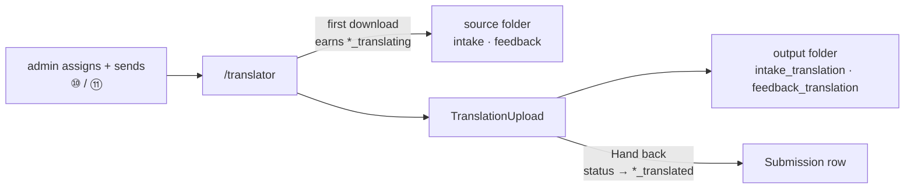

# translation — `src/domains/translation/`

The **translation domain slice** — the translator's output, coming back. The
deliberate mirror of [`feedback`](../feedback/_FeedbackDocumentation.md): that
slice owns what the coach produces, this owns what the translator produces.

Neither lives in `domains/operator`, and for the same reason: both are about the
**thing made**, not the person who made it. A coach's response was never a
property of a coach, and a translation is not a property of a translator.

---

## 1 · The northstar

A submission whose customer and coach share no language goes out for
translation twice — the customer's files on the way to the coach, the coach's
response on the way back to the customer. Each of those is a **leg**. A
translator signs in, sees the legs assigned to them, downloads what they work
from, uploads what they produce, and hands the leg back.

### The invariants

- **A leg is the unit of work, not a submission.** The single genuine asymmetry
  with the coach's side, and the reason for `model/translationLeg.ts`. A coach
  owns a submission — one person, one job, start to finish. A translator can own
  *both* legs of the same submission, weeks apart, pointing in opposite
  directions, so the queue is keyed on `produces` and one submission may appear
  twice. Collapsing to submissions would silently drop one of a translator's two
  jobs — and it would be the second one, long after anyone was watching.
- **Every difference between the two directions lives in `LEGS`.** Which folder
  is read, which is written, which rungs mean sent / working / done. The
  alternative is a ternary at a dozen call sites, each one a chance to get the
  direction backwards — and backwards means handing someone the wrong folder,
  which reads to *them* as our mistake rather than a bug worth reporting.
- **Ownership is checked per leg, never per submission.** Holding the intake leg
  does not authorise writing to the response folder, even on a submission you
  are genuinely working on. Both upload routes and the hand-back action check
  `isAssignedTo(submission, operator, kind)`.
- **Collection is observed, never declared.** `*_translating` is earned by the
  translator's own first download, in `/api/files/[id]` — the same shape as the
  coach's `in_review`. There is no "I've started" button, because it would be a
  button nobody presses.
- **Handing back requires a file and the right rung.** An empty hand-back leaves
  the admin to discover the folder is empty at the moment they try to pass it
  on; a stale tab could otherwise hand back twice, or walk a released submission
  backwards over its own completion.
- **A question about the ladder is a predicate.** `isLegDone` reads an exhaustive
  `Record<SubmissionStatus, boolean>` per leg, so a new rung is a compile error
  rather than a silently wrong comparison (CLAUDE.md §8).

---

## 2 · Honest current state

**Built and deployed 2026-08-31.** The portal runs end to end: queue, download,
upload, hand back, both legs.

| Piece | State |
| --- | --- |
| `model/translationLeg.ts` | ✅ the two legs, and the per-leg ladder predicates |
| `api/translationApi.ts` | ✅ queue read, file save/record, hand back |
| `api/translationActions.ts` | ✅ `handBackTranslationAction`, role + per-leg ownership |
| `ui/TranslationUpload.tsx` | ✅ mirror of `FeedbackUpload`, carries the leg |
| `/api/translation/{blob,complete,upload}` | ✅ mirror of the feedback three |
| `/translator` | ✅ open legs and handed-back legs |

**Not built, and deliberately:**

- **No email when a translator hands back.** The admin finds it on the queue.
  ⑤ tells the admin a *coach* has delivered; whether the translator's hand-back
  deserves the same is an open question rather than an oversight — see §3.
- **No re-open.** A leg handed back is closed to the translator. Correcting one
  is an admin override today, which is the honest place for it while the volume
  is what it is.

---

## 3 · Decisions

**2026-08-31 · The slice exists at all.** The alternative was putting the
translator's verbs in `domains/operator` beside `translatorApi` and
`translatorActions`. Rejected on the precedent already set: the coach is an
operator too, and `domains/feedback` is still its own slice, because what a
person *makes* is not a property of the person. Following that gives this
codebase one rule instead of two.

**2026-08-31 · The queue returns legs, not submissions.** `findByCoach` joins on
the single `feedback` kind, so one row per submission falls out for free. The
translator's join matches either translation kind and a translator may hold
both, so `legsForTranslator` carries `produces` and the portal keys its cards on
`(submission, produces)`. The bug this avoids is quiet: a translator holding
both legs would have seen one card and silently lost the other.

**2026-08-31 · Upload and hand-back stay two acts.** The admin's own
`uploadTranslationAction` advances the status the moment a file lands, because
that is an admin *filing* a translation that already happened off-platform. A
translator uploading their own work is not that: they may upload three files
over an afternoon, and the leg is finished when they say so. Same split, same
reasoning, as the coach's upload versus "Send for approval".

**2026-08-31 · The card leads with the direction.** "The customer's files, for
the coach" sits above the player's name, which is the reverse of the coach's
card. The player's name alone is ambiguous the moment someone holds both legs of
one submission, and that is exactly the person most likely to open the wrong one.

**Open — should handing back email the admin?** Five of the nine numbered
messages tell the admin something, on the principle that a queue which doesn't
announce its arrivals has to be *watched* instead of used. A hand-back is an
arrival by that standard. It is left out for now because the admin's next act is
on the queue anyway, and because ⑩/⑪ were only just built — adding a twelfth
message before anyone has run the eleventh is guessing. Revisit once the
pipeline has carried real work.
