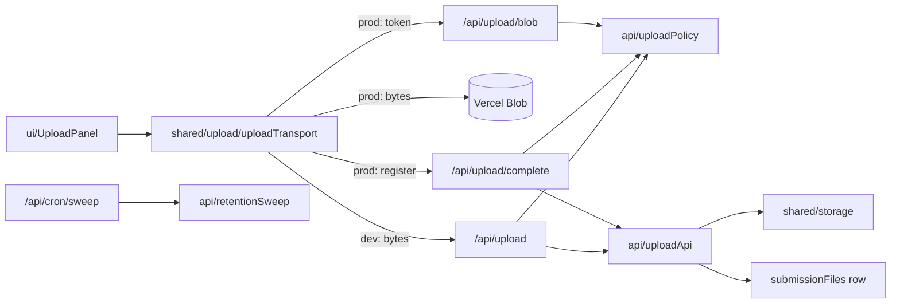

# upload — `src/domains/upload/`

The **upload domain slice** — getting the customer's files to us. All **verb**: it owns what
may be sent, who may send it, and the two ways bytes travel.

---

## 1 · The northstar

A submission carries **several files** — a clip, a still or two, maybe an old report. Each
one lands in storage under the submission's own folder and gets a row in `submissionFiles`.
No transcoding, no streaming — the coach downloads and scrubs locally
([ADR 006](../../../docs/decisions/006-object-storage-over-mux.md)).

### The invariants

- **The gate is `authorizeUpload()`, and every route calls it.** A flow cookie naming a
  submission, a verified email, not already paid, and room under the file limit. Written
  once because three routes need the same answer, and a check in three copies is a check
  that will differ in three ways.
- **Nothing the browser says is trusted.** Type, size, and count are re-checked server-side
  on every single upload, and a locator reported back by the browser must resolve inside
  *this* submission's folder or it's refused.
- **The allowlist lives once**, in `model/fileTypes.ts` — the picker's `accept`, the
  client's pre-check, and the server's validation all read it. That module has no server
  imports so a `"use client"` component can import it directly.
- **The coach downloads via `/api/files/[id]`, operator-only.** The customer never gets their
  own raw files back; the coach's response comes via `/api/feedback/[id]`.
- **This slice sends no email.** With payment last, the one customer confirmation is the
  receipt, and that belongs to `payment`.

### The pieces

- **the GATE** — `api/uploadPolicy.ts` (`authorizeUpload`, `checkFile`).
- **the VERB** — `api/uploadApi.ts` (`storeUploadedFile` for the proxied path,
  `registerUpload` for the direct one) · `api/retentionSweep.ts`
  (`runRetentionSweep`, `sweepAbandoned`) · `api/discardSubmission.ts`
  (`discardUnpaidSubmission` — files and record together, refuses anything paid).
- **the WIRE** — `ui/UploadPanel.tsx` (one dropzone, per-file remove). The
  two-path transport `uploadFile` **moved to `shared/upload/` on 2026-08-06**:
  three domains (`checkout`, `feedback`, `upload`) reached across for it, which is
  exactly the `shared/` test (`_StructureLaw` §5).
- No `model/` record: **there is no Upload entity.** A finished upload is a
  `SubmissionFile`, which belongs to the submission slice.

---

## 2 · Where we are now — 2026-08-28

**The upload step was reworked** (QA 2.3.2–2.3.9.1). It was a chain of cards — an
empty card that turned into an upload, then a separate "+" that spawned the next
empty card, so a second file took two clicks on two elements.

- ✅ **One dropzone, always present, does every add.** A single `Dropzone` (click
  the picker or drag files onto it) starts each upload and stays put for the next,
  up to the limit; it disappears only once `activeCount` reaches `maxFiles`. A
  drag can carry several files — only what still fits under the limit is taken.
- ✅ **A file is type- and size-checked in the browser before a byte is sent**
  (QA 2.3.6, 2.3.8), the same checks the server re-makes on every upload — the
  client copy is a courtesy, never the boundary.
- ✅ **Per-file remove.** Every row carries a remove control: a done file is
  deleted server-side through `onRemoveFile` (checkout's `removeFlowFileAction`,
  scoped to an unpaid `intake` file) before its row leaves; an in-flight upload is
  aborted through its `AbortController`; a refused card just clears.
- ✅ **Uniform row height** (`min-h-[100px]`, QA 2.3.9.1) across uploading, done,
  refused, and the dropzone, so a file completing or being refused doesn't resize
  its row and shove the page.
- ✅ **The uploading card shows the moment a file is chosen** (QA 2.3.3
  regression) — the card is added first, then uploaded into, so progress is
  visible rather than the file uploading invisibly.

### 2026-08-01 — the retention sweep rewrite

**The retention sweep was rewritten** (rollout Phase 6). Three changes, and the
first is the one everything else rests on.

- ✅ **The clock starts on collection**, not completion. 30 days from the
  customer's first download, or 90 from delivery for the customer who never
  comes — **whichever ends later**, so someone who collects on day 80 still gets
  their full window.
- ✅ **Everything is swept together**, the coach's response included. That is only
  safe *because* of the line above: we never delete anything the customer hasn't
  already got in hand. If retention ever moves back to keying off delivery, this
  becomes wrong again — the flow test asserts it, and should start failing.
- ✅ **The warning runs first, against a nearer cutoff.** Run the other way round,
  a single night could both warn and delete — a warning in name only. Ordering the
  two passes *is* the guarantee.
- ✅ **Abandonment measures from `updatedAt`**, not `submittedAt`. "Gone quiet" is
  about the last sign of life, so a customer mid-flow — or one whose card just
  failed — isn't reaped while still working.
- ✅ **Records survive; the submission is kept forever.** Only the bytes go, and
  `/api/files/[id]` answers **410 Gone** so "you may have this, but it no longer
  exists" stays a different sentence from "this was never yours".

⚠️ **Vercel Hobby permits one cron run a day**, so "warn at day 23" means 23–24.
Fine here, and it has already broken a deploy once — an hourly schedule needs Pro.

### Before 2026-08-01

- ✅ **Multi-file upload.** *(The card-chain UI described here was replaced by a
  single dropzone on 2026-08-28 — see above.)* Verified in a browser: two files
  up, `.exe` refused with the right sentence, the Continue button counting
  correctly.
- ✅ **The Vercel body-limit bug is fixed** ([ADR 011](../../../docs/decisions/011-client-direct-uploads.md)).
  This slice's previous doc flagged it as "may need a direct-to-Blob client upload" — it was
  not a *may*: at ~4.5 MB per serverless request body, video upload could never have worked
  in production. The browser now uploads straight to Blob.
- ✅ **Real progress**, which the cards need. `fetch` still can't report upload progress, so
  the dev path uses `XMLHttpRequest` and the Blob path uses the SDK's `onUploadProgress`.
- ✅ **Multipart over 8 MB**, so a phone changing towers retries a part instead of the file.
- ✅ **Retention sweep** — resolved and abandoned rules, customer files only, records kept
  ([ADR 012](../../../docs/decisions/012-retention-and-operator-settings.md)).
- 🔶 **Dev and prod take different paths.** Unavoidable — there's no Blob store on a laptop —
  and mitigated by one `uploadFile()` call and one shared gate. It still means the production
  path is not exercised by local testing.
- 🔶 **Mobile upload untested on real devices** — still the highest-risk part of the flow, and
  now the one most changed.
- 🔶 **No resume across a page reload mid-upload.** A dropped upload restarts; multipart
  retries parts, but a closed tab loses the file.
- 🔶 **A cancelled upload can orphan a Blob object.** If the browser dies between the bytes
  landing and `/api/upload/complete`, the object exists with no row. It isn't billed for
  long — nothing references it and the store is small — but nothing cleans it up either,
  because the sweep works from rows.

---

## 3 · Where we came from

**2026-07-30 · Payment moved last, and one video became many**
([ADR 009](../../../docs/decisions/009-upload-before-payment.md),
[010](../../../docs/decisions/010-verification-gates-upload.md),
[011](../../../docs/decisions/011-client-direct-uploads.md)).

- **The gate changed from "paid" to "verified".** The route used to verify a succeeded
  PaymentIntent against Stripe. Payment now happens *after* this step, so that gate no longer
  exists; a signed flow cookie plus `emailVerifiedAt` replaced it.
- **`videoUrl` became the `submissionFiles` table.** One column can hold one locator; the
  brief asked for videos, images, and documents together.
- **`storeVideo` became `storeUploadedFile` + `registerUpload`** — one verb per path in.
- **`sendVideoReceived` was deleted, not moved.** It fired on the transition out of
  `awaiting_upload`, a status that no longer exists, and its job — "we have your stuff" — is
  now the receipt's, which also lists what arrived.
- **`/api/video/[id]` became `/api/files/[id]`.** The id in the path is the file's now,
  because a submission no longer has exactly one.

**2026-07-29 · Storage cutover** ([ADR 006](../../../docs/decisions/006-object-storage-over-mux.md)).
Mux is gone. The direct-upload + `<MuxUploader>` + `video.asset.ready` webhook were replaced
by a plain uploader that POSTs the file to `/api/upload`, which streams it to the
`shared/storage` seam. `passthrough` (ADR 002) is retired — the submission's own uuid is the
link.

**Before 2026-07-28**, this slice was `lib/mux.ts`, the upload-URL logic inline in
`app/api/mux/upload/route.ts`, and `app/upload/upload-client.tsx`. Step 2 collected them and
lifted the Mux call out of the route handler.

Decisions from the Mux era worth keeping as trail:

- **Errored assets returned to `Awaiting Upload` rather than a dedicated error status.** The
  customer's next action was identical to someone who never uploaded — try again. The
  per-card error state in `UploadPanel` is the same idea, closer to the customer.
- **`UploadClient` renamed `UploadPanel` (Step 2).** "Client" collided with the other meaning
  of the word all over this codebase — Stripe client, Airtable client, the customer. One stem
  per concept.
